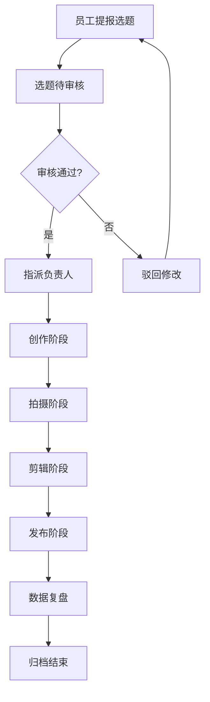

## 1. Product Overview
新媒体协作管理系统是一套纯内网私有化部署的团队协作平台，完整复刻飞书新媒体协作业务流程，支持选题、审核、创作、拍摄、剪辑、发布、数据复盘全流程管理，确保数据100%不外泄，全程离线可用。

## 2. Core Features

### 2.1 User Roles
| Role | Registration Method | Core Permissions |
|------|---------------------|------------------|
| 管理员 | 初始账号创建 | 账号管理、权限配置、全量数据查看、报表导出、模板维护 |
| 编导 | 管理员创建 | 选题审核、任务指派、进度管控、数据复盘 |
| 普通成员 | 管理员创建 | 选题提报、任务跟进、进度更新、通知接收 |

### 2.2 Feature Module
1. **选题管理**: 员工提报、状态流转、审核驳回、指派负责人、历史留痕、筛选搜索
2. **全流程进度管控**: 创作上传版本、拍摄计划登记、剪辑进度审核、发布记录管理
3. **数据复盘台账**: 播放点赞数据录入、月度统计、完成率逾期率计算
4. **人员权限管理**: 角色管理、账号增删禁用、操作日志
5. **本地文件资源库**: 模板管理、内网文件关联、版本留存
6. **消息通知**: 选题提交通知、审核结果通知、任务截止预警、状态变更同步

### 2.3 Page Details
| Page Name | Module Name | Feature description |
|-----------|-------------|---------------------|
| 登录页 | 登录模块 | 账号密码登录、记住密码、登录失败提示 |
| 首页仪表盘 | 概览模块 | 待办任务、今日进度、数据概览、快捷入口 |
| 选题管理 | 选题列表 | 选题列表展示、筛选搜索、状态流转、审核操作 |
| 选题详情 | 详情模块 | 选题详情、历史记录、评论讨论、文件附件 |
| 创作管理 | 创作模块 | 版本上传、创作进度、审核反馈 |
| 拍摄管理 | 拍摄模块 | 拍摄计划、场地安排、设备登记 |
| 剪辑管理 | 剪辑模块 | 剪辑进度、版本审核、成片交付 |
| 发布管理 | 发布模块 | 发布记录、平台管理、发布状态 |
| 数据复盘 | 数据模块 | 数据录入、统计分析、报表导出 |
| 人员管理 | 权限模块 | 账号管理、角色配置、操作日志 |
| 资源库 | 文件模块 | 模板管理、文件上传、版本留存 |
| 消息中心 | 消息模块 | 站内消息、浏览器通知、消息设置 |

## 3. Core Process

## 4. User Interface Design
### 4.1 Design Style
- 主色调: 深蓝色系 (#1e40af)，搭配青色点缀 (#06b6d4)
- 按钮样式: 圆角矩形，hover效果带阴影
- 字体: Inter，标题加粗，正文常规
- 布局: 侧边栏导航 + 顶部栏 + 主内容区，卡片式布局
- 图标: Lucide图标库

### 4.2 Page Design Overview
| Page Name | Module Name | UI Elements |
|-----------|-------------|-------------|
| 登录页 | 登录模块 | 居中卡片、表单输入、登录按钮、品牌logo |
| 首页仪表盘 | 概览模块 | 统计卡片网格、进度条、待办列表、快捷操作按钮 |
| 选题管理 | 选题列表 | 表格展示、筛选栏、操作按钮组、状态标签 |
| 人员管理 | 权限模块 | 用户列表、角色下拉、操作按钮、搜索框 |

### 4.3 Responsiveness
- 桌面优先设计
- 平板端：侧边栏折叠为图标模式
- 移动端：侧边栏转为底部导航

### 4.4 Accessibility
- 语义化HTML结构
- 键盘导航支持
- 颜色对比度符合WCAG标准
