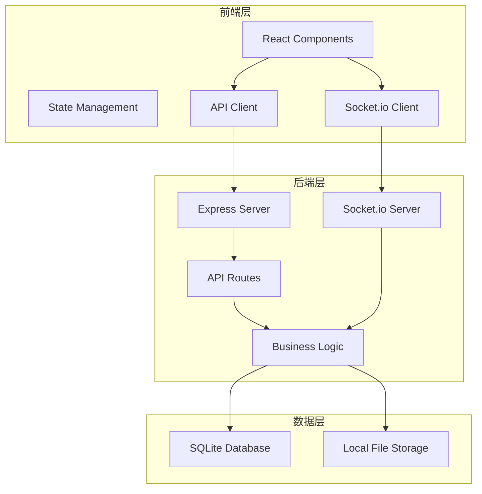
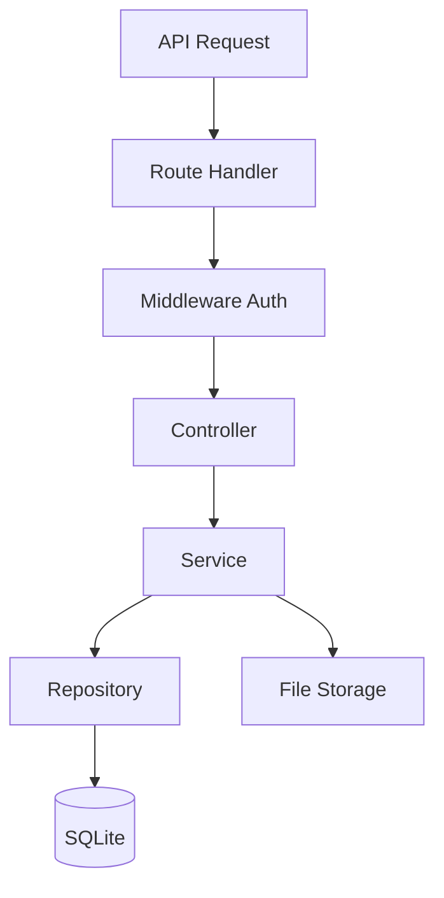
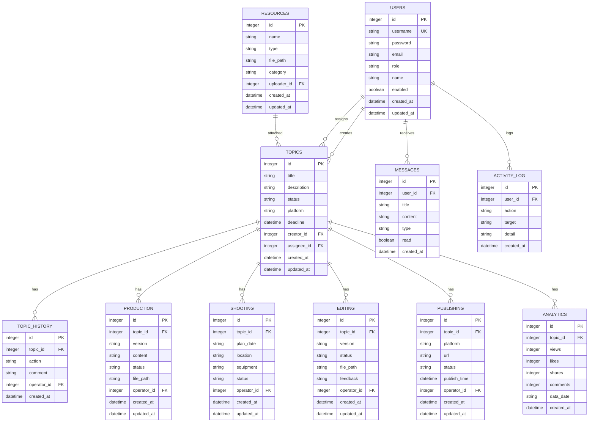

## 1. Architecture Design



## 2. Technology Description
- Frontend: React@18 + TypeScript + Vite@6 + TailwindCSS@3
- Backend: Express@4 + TypeScript + Socket.io@4
- Database: SQLite3 (内置本地数据库)
- State Management: Zustand
- UI Components: Lucide React Icons
- Build Tool: Vite

## 3. Route Definitions

| Route | Purpose | Permission |
|-------|---------|------------|
| /login | 用户登录 | 公开 |
| / | 首页仪表盘 | 登录用户 |
| /topics | 选题管理 | 登录用户 |
| /topics/:id | 选题详情 | 登录用户 |
| /topics/create | 创建选题 | 登录用户 |
| /production | 创作管理 | 登录用户 |
| /shooting | 拍摄管理 | 编导/管理员 |
| /editing | 剪辑管理 | 编导/管理员 |
| /publishing | 发布管理 | 编导/管理员 |
| /analytics | 数据复盘 | 编导/管理员 |
| /users | 人员管理 | 管理员 |
| /resources | 资源库 | 登录用户 |
| /messages | 消息中心 | 登录用户 |

## 4. API Definitions

### 4.1 Auth API
| Endpoint | Method | Description |
|----------|--------|-------------|
| /api/auth/login | POST | 用户登录 |
| /api/auth/logout | POST | 用户登出 |
| /api/auth/me | GET | 获取当前用户 |

### 4.2 Topic API
| Endpoint | Method | Description |
|----------|--------|-------------|
| /api/topics | GET | 获取选题列表 |
| /api/topics | POST | 创建选题 |
| /api/topics/:id | GET | 获取选题详情 |
| /api/topics/:id | PUT | 更新选题 |
| /api/topics/:id | DELETE | 删除选题 |
| /api/topics/:id/audit | POST | 审核选题 |

### 4.3 User API
| Endpoint | Method | Description |
|----------|--------|-------------|
| /api/users | GET | 获取用户列表 |
| /api/users | POST | 创建用户 |
| /api/users/:id | GET | 获取用户详情 |
| /api/users/:id | PUT | 更新用户 |
| /api/users/:id | DELETE | 删除用户 |
| /api/users/:id/role | PUT | 更新用户角色 |

### 4.4 Message API
| Endpoint | Method | Description |
|----------|--------|-------------|
| /api/messages | GET | 获取消息列表 |
| /api/messages/:id | PUT | 标记消息已读 |
| /api/messages | DELETE | 清空消息 |

### 4.5 Analytics API
| Endpoint | Method | Description |
|----------|--------|-------------|
| /api/analytics/monthly | GET | 获取月度统计 |
| /api/analytics/user | GET | 获取用户统计 |
| /api/analytics/team | GET | 获取团队统计 |

### 4.6 Resource API
| Endpoint | Method | Description |
|----------|--------|-------------|
| /api/resources | GET | 获取资源列表 |
| /api/resources | POST | 上传资源 |
| /api/resources/:id | GET | 获取资源详情 |
| /api/resources/:id | DELETE | 删除资源 |

## 5. Server Architecture Diagram



## 6. Data Model

### 6.1 Data Model Definition



### 6.2 Data Definition Language

```sql
CREATE TABLE IF NOT EXISTS users (
    id INTEGER PRIMARY KEY AUTOINCREMENT,
    username TEXT UNIQUE NOT NULL,
    password TEXT NOT NULL,
    email TEXT,
    role TEXT DEFAULT 'member',
    name TEXT,
    enabled BOOLEAN DEFAULT 1,
    created_at DATETIME DEFAULT CURRENT_TIMESTAMP,
    updated_at DATETIME DEFAULT CURRENT_TIMESTAMP
);

CREATE TABLE IF NOT EXISTS topics (
    id INTEGER PRIMARY KEY AUTOINCREMENT,
    title TEXT NOT NULL,
    description TEXT,
    status TEXT DEFAULT 'pending',
    platform TEXT,
    deadline DATETIME,
    creator_id INTEGER,
    assignee_id INTEGER,
    created_at DATETIME DEFAULT CURRENT_TIMESTAMP,
    updated_at DATETIME DEFAULT CURRENT_TIMESTAMP,
    FOREIGN KEY (creator_id) REFERENCES users(id),
    FOREIGN KEY (assignee_id) REFERENCES users(id)
);

CREATE TABLE IF NOT EXISTS topic_history (
    id INTEGER PRIMARY KEY AUTOINCREMENT,
    topic_id INTEGER,
    action TEXT NOT NULL,
    comment TEXT,
    operator_id INTEGER,
    created_at DATETIME DEFAULT CURRENT_TIMESTAMP,
    FOREIGN KEY (topic_id) REFERENCES topics(id),
    FOREIGN KEY (operator_id) REFERENCES users(id)
);

CREATE TABLE IF NOT EXISTS production (
    id INTEGER PRIMARY KEY AUTOINCREMENT,
    topic_id INTEGER,
    version TEXT,
    content TEXT,
    status TEXT DEFAULT 'draft',
    file_path TEXT,
    operator_id INTEGER,
    created_at DATETIME DEFAULT CURRENT_TIMESTAMP,
    updated_at DATETIME DEFAULT CURRENT_TIMESTAMP,
    FOREIGN KEY (topic_id) REFERENCES topics(id),
    FOREIGN KEY (operator_id) REFERENCES users(id)
);

CREATE TABLE IF NOT EXISTS shooting (
    id INTEGER PRIMARY KEY AUTOINCREMENT,
    topic_id INTEGER,
    plan_date DATETIME,
    location TEXT,
    equipment TEXT,
    status TEXT DEFAULT 'pending',
    operator_id INTEGER,
    created_at DATETIME DEFAULT CURRENT_TIMESTAMP,
    updated_at DATETIME DEFAULT CURRENT_TIMESTAMP,
    FOREIGN KEY (topic_id) REFERENCES topics(id),
    FOREIGN KEY (operator_id) REFERENCES users(id)
);

CREATE TABLE IF NOT EXISTS editing (
    id INTEGER PRIMARY KEY AUTOINCREMENT,
    topic_id INTEGER,
    version TEXT,
    status TEXT DEFAULT 'pending',
    file_path TEXT,
    feedback TEXT,
    operator_id INTEGER,
    created_at DATETIME DEFAULT CURRENT_TIMESTAMP,
    updated_at DATETIME DEFAULT CURRENT_TIMESTAMP,
    FOREIGN KEY (topic_id) REFERENCES topics(id),
    FOREIGN KEY (operator_id) REFERENCES users(id)
);

CREATE TABLE IF NOT EXISTS publishing (
    id INTEGER PRIMARY KEY AUTOINCREMENT,
    topic_id INTEGER,
    platform TEXT,
    url TEXT,
    status TEXT DEFAULT 'pending',
    publish_time DATETIME,
    operator_id INTEGER,
    created_at DATETIME DEFAULT CURRENT_TIMESTAMP,
    updated_at DATETIME DEFAULT CURRENT_TIMESTAMP,
    FOREIGN KEY (topic_id) REFERENCES topics(id),
    FOREIGN KEY (operator_id) REFERENCES users(id)
);

CREATE TABLE IF NOT EXISTS analytics (
    id INTEGER PRIMARY KEY AUTOINCREMENT,
    topic_id INTEGER,
    views INTEGER DEFAULT 0,
    likes INTEGER DEFAULT 0,
    shares INTEGER DEFAULT 0,
    comments INTEGER DEFAULT 0,
    data_date DATE,
    created_at DATETIME DEFAULT CURRENT_TIMESTAMP,
    FOREIGN KEY (topic_id) REFERENCES topics(id)
);

CREATE TABLE IF NOT EXISTS messages (
    id INTEGER PRIMARY KEY AUTOINCREMENT,
    user_id INTEGER,
    title TEXT,
    content TEXT,
    type TEXT DEFAULT 'info',
    read BOOLEAN DEFAULT 0,
    created_at DATETIME DEFAULT CURRENT_TIMESTAMP,
    FOREIGN KEY (user_id) REFERENCES users(id)
);

CREATE TABLE IF NOT EXISTS activity_log (
    id INTEGER PRIMARY KEY AUTOINCREMENT,
    user_id INTEGER,
    action TEXT,
    target TEXT,
    detail TEXT,
    created_at DATETIME DEFAULT CURRENT_TIMESTAMP,
    FOREIGN KEY (user_id) REFERENCES users(id)
);

CREATE TABLE IF NOT EXISTS resources (
    id INTEGER PRIMARY KEY AUTOINCREMENT,
    name TEXT,
    type TEXT,
    file_path TEXT,
    category TEXT,
    uploader_id INTEGER,
    created_at DATETIME DEFAULT CURRENT_TIMESTAMP,
    updated_at DATETIME DEFAULT CURRENT_TIMESTAMP,
    FOREIGN KEY (uploader_id) REFERENCES users(id)
);

INSERT INTO users (username, password, email, role, name, enabled) VALUES 
('admin', '$2b$10$EixZaYbB.rK4fl8x2q7Meu6Q6D2V5fF5Q5Q5Q5Q5Q5Q5Q5Q5Q5Q', 'admin@local.dev', 'admin', '管理员', 1),
('director', '$2b$10$EixZaYbB.rK4fl8x2q7Meu6Q6D2V5fF5Q5Q5Q5Q5Q5Q5Q5Q5Q', 'director@local.dev', 'director', '编导', 1),
('member1', '$2b$10$EixZaYbB.rK4fl8x2q7Meu6Q6D2V5fF5Q5Q5Q5Q5Q5Q5Q5Q5Q', 'member1@local.dev', 'member', '员工张三', 1),
('member2', '$2b$10$EixZaYbB.rK4fl8x2q7Meu6Q6D2V5fF5Q5Q5Q5Q5Q5Q5Q5Q5Q', 'member2@local.dev', 'member', '员工李四', 1);
```

## 7. Real-time Messaging

### 7.1 Socket Events

| Event | Description | Payload |
|-------|-------------|---------|
| new_topic | 新选题提交通知 | { topicId, title, creator } |
| topic_audited | 选题审核结果通知 | { topicId, title, status, comment } |
| task_deadline_warning | 任务截止预警 | { topicId, title, deadline } |
| status_changed | 状态变更通知 | { topicId, title, oldStatus, newStatus } |
| overtime_alert | 超时提醒 | { topicId, title, deadline } |
| new_message | 新消息通知 | { userId, title, content } |
