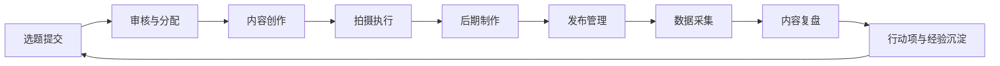
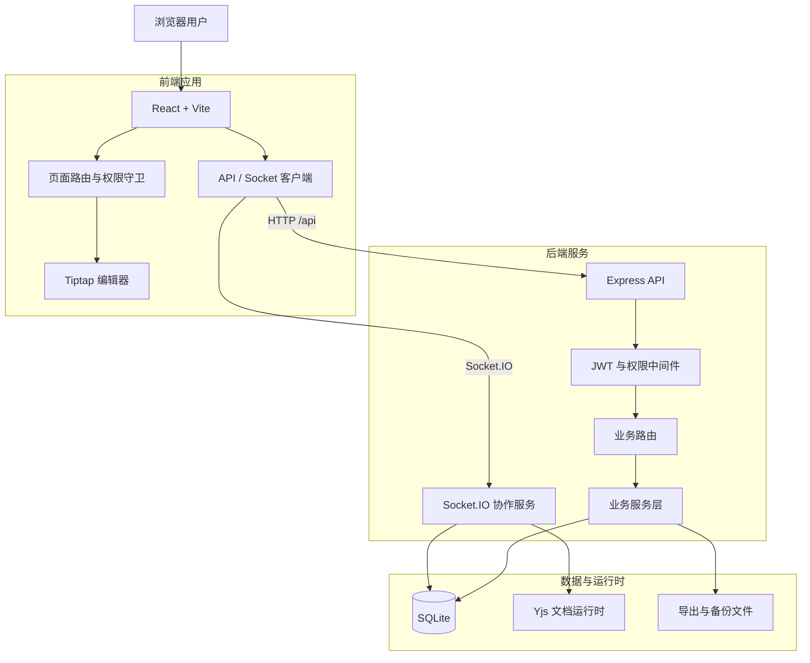
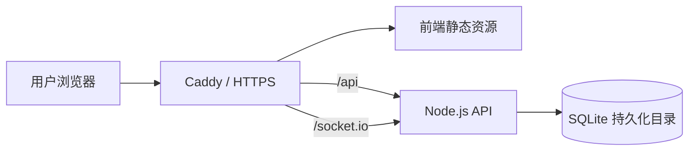

# XMT · 岚曜新媒体协作平台

> 面向传媒与内容团队的全流程内容生产协作中台。

XMT 将选题策划、内容创作、拍摄排期、发布执行、数据复盘、团队协作与权限管理整合到同一套系统中，帮助内容团队减少信息分散、流程断层和多人协作中的重复沟通。

当前版本：**v2.17.0**

项目采用前后端同仓的全栈架构，当前主要面向内部生产环境使用，并持续向可复用、可扩展的内容协作平台演进。

---

## 目录

- [项目简介](#项目简介)
- [核心能力](#核心能力)
- [业务流程](#业务流程)
- [技术栈](#技术栈)
- [系统架构](#系统架构)
- [快速开始](#快速开始)
- [环境变量](#环境变量)
- [常用命令](#常用命令)
- [目录结构](#目录结构)
- [Creator Agent](#creator-agent)
- [开发账号安全](#开发账号安全)
- [API 与实时协作](#api-与实时协作)
- [测试与质量检查](#测试与质量检查)
- [生产部署](#生产部署)
- [开发约定](#开发约定)
- [安全说明](#安全说明)
- [常见问题](#常见问题)
- [Roadmap](#roadmap)
- [贡献指南](#贡献指南)
- [许可证](#许可证)

---

## 项目简介

XMT 是一套面向新媒体、传媒机构和内容生产团队的协作型业务系统。

它围绕以下内容生产主链路建设：

```text
选题立项 → 内容创作 → 拍摄执行 → 发布管理 → 数据复盘
```

在主链路之外，系统还提供日报、日历、消息、资源库、灵感库、工作流、团队协作、权限治理、系统设置和抖音数据能力。

### 适用场景

- 新媒体公司内容生产管理
- 短视频团队选题与创作协作
- 文案、摄像、后期、运营之间的任务流转
- 多账号、多角色、多部门协同
- 内容版本管理与历史追踪
- 发布后数据复盘与行动项管理
- 团队日报、工作记录和管理汇总

### 当前定位

- **当前阶段：** 内容生产团队内部工作中台
- **中期方向：** 品牌化内容协作平台
- **长期方向：** 可复用的行业内容生产基础设施

---

## 核心能力

### 内容生产

- 选题提交、审核、分配与状态流转
- 创作任务管理与内容编辑
- 拍摄计划、人员安排与进度跟踪
- 发布任务与平台信息管理
- 内容分析、复盘和行动项跟踪
- 内容历史版本与变更记录

### 实时协作

- Socket.IO 实时消息通信
- 多人在线状态与协作房间
- Yjs 文档运行时状态
- 协同编辑事件同步
- 文档锁定与解锁
- 冲突检测与断线恢复
- 协作时间线与运行状态记录

### 富文本编辑

- 基于 Tiptap 的内容编辑器
- 标题、段落、列表与引用
- 表格、任务列表和代码块
- 代码语法高亮
- 内容版本保存
- 协同编辑扩展能力

### 组织协作

- 消息中心
- 工作日历
- 灵感库
- 资源中心
- 日报系统
- 番茄钟
- 团队成就与协作记录

### 权限与治理

- JWT 登录认证
- 角色与权限点管理
- 前后端双层权限守卫
- 管理员全局权限
- 资源归属与本人数据控制
- 接口级权限校验
- 登录与 API 请求限流

### 数据与运营

- 内容数据分析
- 复盘报告
- 复盘行动项
- 数据导出
- 抖音账号与作品数据接入
- 抖音趋势、粉丝和运营分析
- OpenAPI、Webhook 与数据同步扩展

### 运维能力

- SQLite 数据库存储
- 健康检查接口
- 数据备份与恢复脚本
- Ubuntu ECS 部署方案
- Caddy 反向代理
- PM2 / systemd 进程管理支持
- GitHub Actions 构建检查

---

## 业务流程



系统并不将选题、稿件和复盘视为互相孤立的数据，而是将它们组织为连续的内容生产过程。

---

## 技术栈

### 前端

| 技术 | 用途 |
|---|---|
| React 18 | 前端界面 |
| TypeScript | 类型系统 |
| Vite | 开发服务器与构建 |
| React Router | 页面路由 |
| Tailwind CSS | 样式体系 |
| Zustand | 全局状态管理 |
| TanStack Query | 服务端状态与请求缓存 |
| Tiptap | 富文本编辑器 |
| Yjs | 协同编辑数据结构 |
| Socket.IO Client | 实时通信 |

### 后端

| 技术 | 用途 |
|---|---|
| Node.js | 服务运行环境 |
| Express | HTTP API |
| TypeScript / TSX | 后端开发与运行 |
| Socket.IO | 实时协作与消息 |
| JWT | 用户认证 |
| bcrypt | 密码哈希 |
| express-rate-limit | 请求限流 |
| `@libsql/client` | SQLite / libSQL 数据访问 |
| Playwright | 自动化测试与数据采集 |

### 基础设施

| 技术 | 用途 |
|---|---|
| SQLite | 默认业务数据库 |
| Caddy | HTTPS 与反向代理 |
| PM2 / systemd | 生产进程管理 |
| GitHub Actions | 类型检查和构建验证 |
| 阿里云 ECS | 当前生产部署环境 |

---

## 系统架构



### 架构特点

- 前后端同仓，便于统一类型、接口和业务规则
- HTTP API 与 Socket.IO 实时通道并存
- SQLite 作为默认存储，适合当前团队规模与部署方式
- Yjs 负责协同文档的运行时状态
- 前后端均设置权限守卫，后端校验为最终安全边界
- 系统优先保证数据库安全和可恢复性

---

## 快速开始

### 运行要求

建议准备以下环境：

- Node.js 22 LTS
- npm 10 或更高版本
- Git
- Windows、macOS 或 Linux

> GitHub Actions 当前以 Node.js 22 为主要验证环境。生产环境使用其他 Node.js 版本前，建议先完成完整构建和冒烟测试。

Apple Silicon Mac 应使用原生 arm64 Node.js，不要复用 Windows 或 Intel Mac 生成的 `node_modules`。可在安装依赖前确认运行架构：

```bash
node --version
npm --version
node -p "process.arch"
```

最后一条命令应输出 `arm64`。

### 1. 克隆项目

```bash
git clone https://github.com/li94930148/xmt.git
cd xmt
```

### 2. 安装依赖

```bash
npm ci
```

日常初始化优先使用 `npm ci`，以 `package-lock.json` 锁定的版本为准。只有明确要调整依赖并同步更新锁文件时才使用 `npm install`。

### 3. 创建环境变量

macOS / Linux：

```bash
cp .env.example .env
```

Windows PowerShell：

```powershell
Copy-Item .env.example .env
```

本地开发建议至少明确以下配置，并为每台开发机生成独立的随机 JWT 密钥：

```env
HOST=127.0.0.1
PORT=3001
JWT_SECRET=<local-random-secret>
XMT_DB_PATH=data/xmt.db
DOUYIN_SYNC_SCHEDULER_ENABLED=false
SOCIAL_INGESTION_SCHEDULER_ENABLED=false
```

`.env` 仅保存在本机，不得提交到 Git。未配置平台密钥时，应保持外部同步、定时采集和自动调度关闭。

### 4. 启动开发环境

```bash
npm run dev
```

默认地址：

| 服务 | 地址 |
|---|---|
| 前端 | `http://localhost:5174` |
| 后端 | `http://127.0.0.1:3001` |
| 健康检查 | `http://127.0.0.1:3001/api/health` |

Vite 会将 `/api` 和 `/socket.io` 请求代理到本地后端。

### 5. 检查服务状态

```bash
curl http://127.0.0.1:3001/api/health
```

正常情况下会返回类似结果：

```json
{
  "success": true,
  "status": "ok",
  "service": "xmt-api",
  "environment": "development",
  "database": {
    "ok": true
  }
}
```

---

## 环境变量

实际配置请以 `.env.example` 和后端源码为准。

### 基础配置

| 变量 | 示例 | 说明 |
|---|---|---|
| `NODE_ENV` | `development` | 运行环境 |
| `HOST` | `127.0.0.1` | 后端监听地址 |
| `PORT` | `3001` | 后端端口 |
| `JWT_SECRET` | 随机长字符串 | JWT 签名密钥 |
| `TRUST_PROXY` | `1` | 反向代理信任层级 |

### 数据库配置

系统默认数据库位置为：

```text
data/xmt.db
```

可通过以下变量覆盖：

```env
XMT_DB_PATH=/absolute/path/to/xmt.db
```

部分代码同时兼容：

```env
DATABASE_PATH=/absolute/path/to/xmt.db
DATABASE_URL=file:/absolute/path/to/xmt.db
```

生产环境建议使用绝对路径，并将数据库文件放在独立、可备份的持久化目录中。

本地开发数据库应是独立工作副本。首次启动可由应用创建 `data/xmt.db`，并执行现有的幂等初始化、迁移和启动备份。不要让开发环境直接打开下载目录中的原始数据库或生产数据库；迁移前先保留不可变备份，数据库文件、WAL、SHM 和备份均不得提交到 Git。

### 跨域配置

```env
CORS_ORIGINS=http://localhost:5174,https://example.com
```

部分部署配置也可能使用：

```env
ALLOWED_ORIGINS=http://localhost:5174,https://example.com
```

### 限流配置

项目包含全局 API 限流、登录 IP 限流和登录账号限流。

常见配置项：

```env
API_RATE_LIMIT_ENABLED=true
API_RATE_LIMIT_WINDOW_MS=60000
API_RATE_LIMIT_MAX=1200

LOGIN_IP_RATE_LIMIT_ENABLED=true
LOGIN_IP_RATE_LIMIT_WINDOW_MS=300000
LOGIN_IP_RATE_LIMIT_MAX=100

LOGIN_ACCOUNT_RATE_LIMIT_ENABLED=true
LOGIN_ACCOUNT_RATE_LIMIT_WINDOW_MS=900000
LOGIN_ACCOUNT_RATE_LIMIT_MAX=15

RATE_LIMIT_DIAGNOSTICS=false
```

### 抖音开放平台配置

需要使用抖音数据能力时，请根据开放平台应用信息补充：

```env
DOUYIN_CLIENT_KEY=
DOUYIN_CLIENT_SECRET=
DOUYIN_REDIRECT_URI=
DOUYIN_WEBHOOK_SECRET=
DOUYIN_SYNC_SCHEDULER_ENABLED=false
```

具体变量名称和回调配置请以项目中的 `.env.example`、抖音相关服务代码和开放平台后台为准。

---

## 常用命令

| 命令 | 说明 |
|---|---|
| `npm run dev` | 同时启动前端和后端开发服务 |
| `npm run start` | 启动后端服务 |
| `npm run build` | 执行 TypeScript 检查并构建前端 |
| `npm run check` | 执行 TypeScript 类型检查 |
| `npm run lint` | 执行 ESLint 检查 |
| `npm run test:e2e` | 执行登录态 E2E 冒烟测试 |
| `npm run test:daily-reports` | 执行日报模块冒烟测试 |
| `npm run test:retrospectives` | 执行复盘模块冒烟测试 |

仓库中还包含抖音、社媒复盘、权限检查、数据同步和导出相关脚本。完整命令请查看 `package.json` 的 `scripts` 字段。

---

## 目录结构

```text
xmt/
├── agent/                     # Creator Agent 独立桌面端项目
├── api/                       # Express 后端
│   ├── collaboration/         # 协作运行时与 Yjs 逻辑
│   ├── database/              # 数据库连接、初始化和迁移
│   ├── middleware/            # 认证、权限、限流等中间件
│   ├── routes/                # API 路由
│   ├── services/              # 业务服务
│   ├── utils/                 # 后端工具
│   ├── app.ts                 # Express 与 Socket.IO 应用装配
│   └── server.ts              # 服务启动入口
├── data/                      # 本地 SQLite 与启动备份（不纳入 Git）
├── deploy/                    # 生产部署脚本与说明
├── docs/                      # 项目设计、架构和开发文档
├── public/                    # 静态资源
├── scripts/                   # 测试、同步、导出和维护脚本
├── shared/                    # 前后端共享类型与规则
├── src/                       # React 前端
│   ├── api/                   # 前端 API 封装
│   ├── collaboration/         # 前端协作层
│   ├── components/            # 通用组件
│   ├── config/                # 导航与运行配置
│   ├── pages/                 # 页面
│   ├── stores/                # Zustand 状态
│   ├── types/                 # 前端类型
│   └── App.tsx                # 前端路由入口
├── .env.example               # 环境变量示例
├── package.json               # 依赖与命令
├── vite.config.ts             # Vite 配置
└── README.md
```

### 推荐阅读顺序

新接手项目时建议依次查看：

1. `README.md`
2. `docs/文档索引.md`
3. `docs/项目说明.md`
4. `docs/产品愿景.md`
5. `docs/产品路线图.md`
6. 与当前任务相关的架构、数据库、权限或测试文档

---

## Creator Agent

`agent/` 是独立的 Creator Agent 桌面端项目，不是主 Web 项目的运行依赖。当前实现包含 `chrome.exe`、PowerShell、`taskkill`、Windows DPAPI 和 NSIS portable 等 Windows 专属能力，因此目前只支持 Windows。

在 macOS 上开发和运行主 Web 项目时：

- 不需要安装 `agent/` 下的依赖
- 不要尝试复用其 Windows 二进制文件或打包流程
- Creator Agent 的 macOS 支持应作为独立适配任务处理，并单独验证浏览器、凭据存储、进程管理和安装包方案

---

## 开发账号安全

数据库初始化逻辑可能为全新的本地数据库创建开发账号，具体行为以当前源码为准。有效的本地登录信息应通过项目负责人提供的安全渠道获取，不在 README、提交记录或聊天记录中保存明文密码。

首次登录后应立即修改临时口令；生产环境不得使用开发账号或默认口令。不要通过读取密码散列、绕过认证或批量试探账号来获取访问权限。

---

## API 与实时协作

### API 基础路径

```text
/api
```

常见接口域包括：

```text
/api/auth
/api/topics
/api/users
/api/messages
/api/analytics
/api/resources
/api/workflow
/api/douyin
/api/daily-reports
/api/reports
/api/retrospectives
/api/collaboration
/api/content
/api/health
```

### 登录示例

```bash
curl -X POST http://127.0.0.1:3001/api/auth/login \
  -H "Content-Type: application/json" \
  -d '{
    "username": "<local-username>",
    "password": "<local-password>"
  }'
```

登录成功后，后续请求通过 Bearer Token 认证：

```bash
curl http://127.0.0.1:3001/api/topics \
  -H "Authorization: Bearer YOUR_TOKEN"
```

### 响应结构

多数新接口使用统一响应格式：

```json
{
  "success": true,
  "data": {},
  "message": "操作成功",
  "pagination": {
    "page": 1,
    "limit": 20,
    "total": 100
  }
}
```

错误响应可能包含：

```json
{
  "success": false,
  "error": "错误说明",
  "code": "ERROR_CODE"
}
```

### Socket.IO

实时协作通道默认使用：

```text
/socket.io
```

主要用于：

- 用户在线状态
- 协作房间
- 文档同步
- 增量更新
- 心跳检测
- 文档锁定
- 冲突事件
- 业务通知

Socket 连接需要携带有效 JWT。具体事件名称以协作模块中的事件定义为准。

---

## 测试与质量检查

### 提交前基础检查

```bash
npm run check
npm run build
```

建议同时执行：

```bash
npm run lint
```

当前仓库可能仍存在历史 ESLint 债务，因此 CI 的主要阻塞项以类型检查和生产构建为主。新增或修改的代码不应继续扩大 lint 问题。

### 日报模块测试

```bash
API_BASE_URL=http://localhost:3001/api \
TOKEN=普通用户临时令牌 \
ADMIN_TOKEN=管理员临时令牌 \
npm run test:daily-reports
```

### 复盘模块测试

```bash
API_BASE_URL=http://localhost:3001/api \
TOKEN=普通用户临时令牌 \
ADMIN_TOKEN=管理员临时令牌 \
npm run test:retrospectives
```

### E2E 测试

```bash
E2E_BASE_URL=http://localhost:5174 \
E2E_USERNAME=测试用户名 \
E2E_PASSWORD=测试密码 \
npm run test:e2e
```

> 不要将真实 Token、账号、密码或生产密钥写入代码、脚本、README、提交记录或 CI 配置。

---

## 生产部署

仓库的 `deploy/` 目录包含 Ubuntu ECS、Caddy、备份和进程管理相关说明。

### 推荐生产拓扑



### 构建

```bash
npm ci
npm run check
npm run build
```

### 启动与进程管理

生产环境的启动、PM2 或 systemd 配置必须以目标服务器的受控部署方案为准，不要把本地开发命令直接用于生产。执行前请依次查看 `docs/上线前检查清单.md`、`docs/上线回滚方案.md` 以及 `deploy/` 中与目标环境对应的脚本和示例配置。

### Caddy 反向代理

应至少代理以下路径：

```text
/api/*
/socket.io/*
```

同时将其余请求指向前端构建产物。

### 部署前检查

- 已备份生产数据库
- `.env` 中不存在默认 JWT 密钥
- 已配置正确的域名与 CORS 来源
- 已确认数据库使用持久化绝对路径
- 已执行 `npm run check`
- 已执行 `npm run build`
- 已验证 `/api/health`
- 已验证登录与关键业务接口
- 已确认 Socket.IO 连接策略
- 已设置数据库和备份文件权限

### 数据库备份

SQLite 数据库是当前系统最重要的生产资产。任何部署、迁移、清理或大规模数据修复前，都应使用经过验证的备份流程；可参考 `deploy/linux/backup-xmt.sh`，但必须先核对目标服务器路径、权限和运行状态。

数据库启用 WAL 时，不能在未知运行状态下只复制主文件，否则备份可能不完整。不得用本地数据库覆盖生产数据库，也不得把生产数据库下载到仓库工作区后直接运行。

---

## 开发约定

### 权限规则

- 前端权限控制用于界面展示和交互限制
- 后端权限校验是最终安全边界
- 新增写接口必须明确所需权限
- 涉及个人数据时必须校验资源归属
- 管理员能力与普通角色能力应保持清晰边界
- 不要仅依赖菜单隐藏实现权限控制

### 数据规则

- 数据库结构变更必须提供可重复执行的迁移逻辑
- 不得在生产数据库上直接尝试未经验证的破坏性 SQL
- 涉及批量修改时先创建备份
- 对重要业务数据保留创建人、更新时间和状态记录
- 媒体文件优先保存 URL，不直接占用业务服务器空间

### API 规则

- 优先使用统一响应结构
- 错误信息应可供前端明确展示
- 写接口需要认证、权限和输入校验
- 列表接口应提供分页能力
- 不在接口响应中泄露密码哈希、密钥和敏感配置
- 新增接口后同步更新前端 API 封装和相关文档

### 前端规则

- 优先复用统一页面组件和状态组件
- 页面需覆盖加载、空数据、错误和无权限状态
- 避免在高频编辑或光标事件中触发无必要的 React 重渲染
- 编辑器相关变更需验证单人、多人、断线和只读场景
- 权限按钮不可只隐藏，还要处理直接访问和接口失败

### 文档规则

涉及以下改动时，应同步更新 `docs/`：

- 架构边界
- 数据库结构
- 权限模型
- API 规范
- 部署方式
- 协作协议
- 产品流程
- 测试方式

文档总入口为：

```text
docs/文档索引.md
```

---

## 安全说明

### 必须修改的配置

生产环境上线前必须修改：

- `JWT_SECRET`
- 默认账号密码
- 数据库文件权限
- CORS 来源
- 抖音应用密钥
- Webhook 验签密钥
- 部署服务器登录凭据

### 不应提交到 Git 的内容

```text
.env
data/
*.db
*.db-wal
*.db-shm
*.db.backup*
certs/
backups/
node_modules/
dist/
.DS_Store
生产日志
访问令牌
平台密钥
真实账号密码
```

### 请求限流

系统默认包含多级限流。当接口返回 `429 Too Many Requests` 时，应检查：

- `Retry-After` 响应头
- 返回结果中的限流维度
- 反向代理是否正确传递客户端 IP
- `TRUST_PROXY` 配置是否正确
- 前端是否发生重复请求或死循环
- 自动化脚本是否设置合理间隔

不要通过直接关闭全部限流来掩盖前端重复请求或代理配置错误。

---

## 常见问题

### 前端能打开，但接口全部返回 401

确认请求是否携带：

```http
Authorization: Bearer YOUR_TOKEN
```

同时确认：

- Token 未过期
- 用户仍然存在
- 用户未被禁用
- JWT 密钥没有在服务重启时发生变化

### 登录接口返回 429

登录限流可能按 IP 和账号两个维度生效。

处理方式：

1. 查看响应中的 `Retry-After`
2. 等待限制窗口结束
3. 检查是否存在自动重复登录
4. 检查反向代理客户端 IP 配置
5. 仅在开发环境适当调整限流阈值

### `npm run build` 通过，但 `npm run lint` 失败

仓库可能存在历史 lint 债务。构建通过只代表类型检查和生产构建成功，不代表所有代码风格问题已解决。

新增代码应尽量保持 lint 通过，并逐步清理旧问题。

### Socket.IO 无法连接

检查：

- 后端服务是否运行
- `/socket.io` 是否被 Caddy 正确代理
- CORS 来源是否允许当前域名
- Token 是否正确传入 Socket 握手
- HTTPS 页面是否尝试连接 HTTP Socket
- 生产环境是否临时固定为 polling 模式
- 代理是否支持 WebSocket Upgrade

### 健康检查正常，但页面仍然报错

`/api/health` 只验证服务和基础数据库连接，不代表所有业务模块都正常。

还应继续检查：

- 浏览器控制台
- 后端日志
- 具体业务接口响应
- 用户权限
- 数据库迁移状态
- Socket.IO 连接状态

### 修改数据库路径后找不到原数据

确认实际生效的是哪个变量：

```env
XMT_DB_PATH=
DATABASE_PATH=
DATABASE_URL=
```

同时检查启动目录和数据库绝对路径。生产环境不建议依赖相对路径。

### 本地通知功能不可用

部分浏览器通知能力要求 HTTPS。开发环境可在 `certs/` 中配置本地证书，再以 HTTPS 启动前后端。

---

## Roadmap

### 当前阶段：工程治理与稳定性

- [x] 内容生产主流程
- [x] JWT 登录与基础权限
- [x] SQLite 数据持久化
- [x] Tiptap 富文本编辑
- [x] Socket.IO 实时通信
- [x] Yjs 协作运行时基础
- [x] 日报与复盘模块
- [x] 健康检查与部署脚本
- [ ] 统一版本号口径
- [ ] 逐步清理历史 lint 债务
- [ ] 完善自动化测试覆盖
- [ ] 收敛前后端协作抽象
- [ ] 补齐统一 API 文档

### 下一阶段：内容协作产品化

- [ ] 完善多人实时编辑体验
- [ ] 增强冲突解释与恢复能力
- [ ] 完善内容版本和时间线
- [ ] 统一任务、日历与消息联动
- [ ] 完善角色与权限矩阵
- [ ] 建设移动端便携办公能力
- [ ] 完善抖音开放平台数据链路

### 长期方向：平台化

- [ ] 多组织与多团队支持
- [ ] 可配置工作流
- [ ] 多平台内容发布与数据回流
- [ ] 内容知识库与智能检索
- [ ] 可插拔的数据分析模块
- [ ] 行业化模板与部署方案

---

## 贡献指南

当前项目以内部持续迭代为主，也欢迎通过 Issue 和 Pull Request 提交问题与改进建议。

### 推荐流程

1. 阅读 `docs/文档索引.md`
2. 从 `main` 创建功能分支
3. 完成代码修改
4. 执行类型检查和构建
5. 补充相关测试
6. 同步更新文档
7. 提交 Pull Request

### 分支命名建议

```text
feature/功能名称
fix/问题名称
refactor/模块名称
docs/文档名称
chore/维护事项
```

### 提交信息建议

```text
feat: 增加日报抄送能力
fix: 修复协同编辑断线重连
refactor: 统一选题权限判断
docs: 更新生产部署说明
chore: 清理无用测试脚本
```

### Pull Request 最低要求

- 说明修改目的
- 列出主要改动
- 标明数据库影响
- 标明权限影响
- 标明部署影响
- 提供测试结果
- 涉及界面时附截图
- 涉及数据迁移时附回滚方案

---

## 版本说明

仓库中可能同时存在两类版本信息：

- `package.json` 中的工程包版本
- 系统内变更日志中的产品版本

两者在部分历史阶段可能没有完全同步。发布新版本时建议统一更新：

- `package.json`
- 系统变更日志
- 部署说明
- Git Tag
- Release Notes

---

## 许可证

当前 `package.json` 声明为 **ISC License**。

在仓库补充独立 `LICENSE` 文件前，具体授权范围应以仓库所有者的最终声明为准。

---

## 维护与反馈

- 仓库：<https://github.com/li94930148/xmt>
- 问题反馈：请使用 GitHub Issues
- 代码贡献：请使用 GitHub Pull Requests

---

<p align="center">
  XMT · 让内容生产从分散协作走向统一流程
</p>
