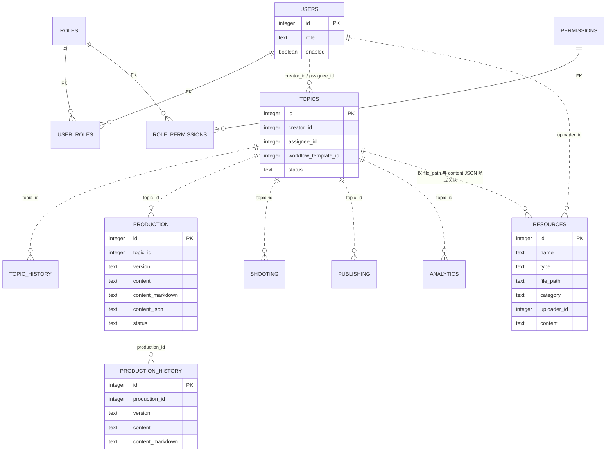

# XMT 资料中心建设分析报告

> 分析日期：2026-07-29  
> 分析范围：`src/`、`api/`、SQLite 实际 schema、数据库初始化/迁移逻辑、现有业务模型，以及 `/Users/youfeifei/Projects/山东地情档案.zip`。  
> 阶段边界：本报告只做代码、架构、资料与方案分析；未修改业务代码，未创建数据库迁移，未部署。  
> 目标边界：建设企业资料资产中心，不建设 AI 知识库、embedding 或向量数据库。

## 0. 执行摘要

XMT 已具备资料中心的导航骨架、内容档案浏览页、通用 `resources` 表和资源 CRUD API，但目前还不能承担企业资料资产管理：项目资料库、企业知识库和素材归档库仍是占位页；`resources` 只有 8 个宽泛字段，既混存“业务快照”又预留“普通文件”，没有物理文件元数据、分类树、标签、关联关系、访问级别、审计与全文索引；资源 API 也未接入现有 permission 中间件。

山东地情档案适合导入企业知识库，但不应按 ZIP 或“每本书一个大文本”保存。档案解压后是 16,027 个 UTF-8 TXT 章节，总展开大小 105,764,847 字节（约 100.86 MiB），目录本身已表达“地区资料库 → 书目 → 卷/栏目 → 文章”的结构，适合建立“书目级资料 + 章节级文档”的层级记录并直接全文索引。当前没有 PDF、Word 或图片，因此本批次不需要 OCR。

推荐的开发先后顺序是：**A 数据库 → B 后端 API → D 文件导入系统 → C 前端页面**。其中第一阶段先建立稳定的数据边界与权限语义；随后 API 固化契约；再用山东档案对导入、分类、检索和幂等性做真实压力验证；最后基于稳定接口完成页面，避免前端继续围绕占位数据返工。

## 1. 当前代码分析

### 1.1 技术与持久化形态

- 前端：React + TypeScript + React Router；资料相关页面复用 `src/components/studio/` 下的 XMT Studio 组件与设计 token。
- 后端：Express + TypeScript；认证为 JWT Bearer Token。
- 数据库：`@libsql/client` 直接访问 SQLite，主库为 `data/xmt.db`，启用 WAL 和外键开关。
- Schema 管理：没有独立 ORM models 目录，也没有规范的逐版本 migration 目录；主要在 `api/database/db.ts` 中以 `CREATE TABLE IF NOT EXISTS` 和容错式 `ALTER TABLE` 做运行时迁移。`scripts/` 中有专项迁移/审计脚本，但不是统一迁移框架。
- 当前工作库规模：73 个选题、46 条生产稿件、132 条稿件历史、26 条拍摄记录、21 条发布记录、20 条分析记录、158 条选题历史；`resources` 共 15 条，全部是 `type=archive/category=已完成` 的内容归档。

### 1.2 资料中心相关文件、功能与完成度

| 文件路径 | 当前功能 | 完成度判断 | 主要问题 |
|---|---|---:|---|
| `src/pages/AssetCenter.tsx` | 资料中心概览；四个库的入口卡片；项目/知识/素材子路由共用占位说明 | 约 25% | 三个库无真实列表、详情、上传、分类与检索；文案仍提到 AI/向量检索，与本期边界冲突；四库只是前端常量而非数据域 |
| `src/pages/Resources.tsx` | 已发布内容档案列表、名称搜索、分页、详情、多 Tab 展示稿件/制作/发布/历史、删除 | 约 70%（仅内容档案场景） | 无分类/标签筛选、无上传/编辑、无统一资料详情；删除会直接删快照；页面把 JSON 快照当资料；只按名称搜索 |
| `src/api/resources.ts` | 调用归档列表、详情与删除接口 | 约 35% | 前端 API 面只覆盖内容档案；没有通用资料 CRUD、上传、分类、标签、关联和全文搜索契约 |
| `api/routes/resources.ts` | 通用资源 CRUD、分类去重、内容归档列表/详情 | 约 45% | 不处理 multipart/物理文件；输入校验弱；没有细粒度权限中间件；普通用户只能看本人上传，协作语义不足；搜索只有 `name LIKE`；无标签、层级、关联、软删除、审计、下载授权 |
| `api/services/publishedArchive.ts` | 发布完成后把 topic、approved production、shooting、publishing、analytics、topic history 序列化进 `resources.content` | 约 75%（自动快照） | 用 JSON 冗余业务数据；没有显式 `topic_id`；原业务更新后会覆盖快照，版本与不可变归档语义不清；无法用外键查询；未包含 production history 和 comments 的完整结构 |
| `src/config/navigation.ts` | 资料中心一级分组和 5 个入口 | 导航 100% | 所有资料入口没有 permissions/roles 限制，登录用户均可见 |
| `src/App.tsx` | 注册 `/asset-center`、三个子库和 `/resources` 路由 | 路由 100% | 路由只受通用登录保护，没有资料权限门禁 |
| `src/components/studio/ResourceTypeBadge.tsx` | 根据类型显示资料类型徽标 | 可复用 | 当前实际只固定显示“文档”，类型体系尚未统一 |
| `src/components/CommandPalette.tsx` | 提供资料中心与内容档案快捷导航 | 可复用 | 尚无权限感知的资料动作 |

### 1.3 当前实现的关键缺口

1. **“资源”概念混杂**：`resources` 同时被设计为普通资料和发布归档容器，而现有数据全部是内容生命周期 JSON 快照。
2. **没有文件资产模型**：`file_path` 只是字符串；无原始文件名、MIME、扩展名、大小、哈希、存储键、下载名、可用状态。
3. **没有结构化分类与标签**：`category` 是自由文本，不支持父子分类、排序、跨库隔离或治理。
4. **没有业务关联模型**：项目、选题、production、用户关系无法稳定表达；目前 XMT 甚至没有独立 `projects` 表。
5. **没有全文检索**：名称 `LIKE` 不能搜索正文；SQLite 已启用 FTS5，可以在现有技术栈内实现。
6. **权限只做所有权**：资源路由只判断 admin/director 或 uploader；POST 对任意登录用户开放，且没有 `resource:*` permission。
7. **缺少生命周期治理**：无草稿/发布/归档、可见范围、软删除、版本、下载审计和批量导入任务状态。

## 2. 当前数据库分析

### 2.1 已有资料相关表检查

| 能力 | 当前是否存在 | 现状 |
|---|---|---|
| 资料表 | 部分存在 | `resources` 可复用为资料主表，但字段不足且已承载内容快照 |
| 文件表 | 不存在 | 只有 `resources.file_path`，不是文件实体 |
| 标签表 | 不存在 | `video_tags` 是抖音视频专用，不应跨域复用 |
| 分类表 | 不存在 | `content_categories` 是社媒内容分类专用；`resources.category` 只是文本 |
| 项目表/项目关联表 | 不存在 | 当前“项目”更多是 UI/业务概念，未发现独立 `projects` 表 |
| 内容关联表 | 不存在 | 发布档案通过 `file_path=archive/topic-{id}` 和 JSON 内嵌 topic 隐式关联 |
| 用户关联 | 部分存在 | `resources.uploader_id` 存在，但 schema 未声明外键 |
| 全文索引 | 不存在 | SQLite 编译已启用 FTS5 |

### 2.2 当前核心 ER 结构

数据库多数业务关联依赖约定字段，实际 schema 未声明外键；下图实线表示已声明的数据库外键，虚线表示代码/字段层面的逻辑关联。



### 2.3 当前内容生产体系及资料关联点

| 环节 | 主表 | 版本/历史 | 资料中心关联建议 |
|---|---|---|---|
| 选题 | `topics` | `topic_history` | 项目调研资料、参考资料关联到 topic；发布后内容档案保留 topic 关联 |
| 创作/稿件 | `production` | `production_history` | 资料可被稿件引用；正式版本可作为内容档案组成项，但不应把所有内容只塞入 JSON |
| 成片制作 | `shooting` + polymorphic `comments` | 无独立 shooting history | 原始素材、交付素材进入素材归档库，并关联 topic/shooting |
| 发布作品 | `publishing` | 无独立 publishing history | 已发布作品与成稿形成内容档案，关联平台 URL 与发布时间 |
| 数据表现 | `analytics` | 按 `data_date` 可多条 | 内容档案详情可读取最新/历史指标，不建议复制成不可查询 JSON |
| 自动归档 | `resources` + `publishedArchive` | 每次同步覆盖同一记录 | 保留自动归档入口，但改为显式关联与快照版本；避免覆盖导致历史失真 |

现有生产链的主键关系清晰，资料中心应以“关系表”连接，不应侵入或重写业务表。项目域目前缺失，短期可将“项目资料库”按 topic 聚合；若业务确认一个项目包含多个选题，则正式建设 `projects` 和 `project_topics`，不要把项目名称继续藏在 `topics.description` 的“项目背景”文本中。

## 3. 当前权限体系与接入建议

### 3.1 现状

- 用户表同时保留 `users.role`，又通过 `user_roles → roles → role_permissions → permissions` 计算权限。
- admin 在前后端均有超级权限短路；director 被 `isPrivilegedUser` 视为全局内容/资源管理者。
- editor、copywriter、post_production、camera 被视为内容编辑角色；member 可以查看全部内容，但通常不能编辑。
- 当前角色数量与权限数：admin 52、director 43、editor 15、member 9；尚无任何 `resource:*` 权限。
- 权限中间件支持“任一权限”和“全部权限”，并有 5 分钟内存缓存。
- 资料导航未声明权限，资源 API 也未使用 `requirePermission`；资源访问靠角色加 uploader 所有权判断。

### 3.2 建议新增的权限码

优先复用现有 RBAC 表和中间件，只增加权限数据与资源范围策略：

| 权限码 | 含义 |
|---|---|
| `resource:view` | 查看自己有范围权限的资料 |
| `resource:create` | 上传/新建资料 |
| `resource:update` | 编辑元数据、分类、标签、关联 |
| `resource:delete` | 软删除资料 |
| `resource:download` | 下载原文件 |
| `resource:manage` | 跨用户、跨分类治理与恢复 |
| `resource:category_manage` | 管理分类树 |
| `resource:import` | 执行批量导入 |
| `resource:audit` | 查看导入、下载、删除等审计记录 |

建议默认矩阵：

| 角色 | 查看 | 上传 | 编辑 | 删除 | 分类管理 | 批量导入 | 全局管理 |
|---|---:|---:|---:|---:|---:|---:|---:|
| admin | 是 | 是 | 是 | 是 | 是 | 是 | 是 |
| director | 是（全部） | 是 | 是（全部） | 是（全部，软删） | 是 | 是 | 是 |
| editor | 是（团队/公开） | 是 | 自己上传或被授权 | 自己上传且未锁定 | 否 | 否 | 否 |
| member | 是（团队/公开） | 可按组织策略开放 | 自己上传的草稿 | 否 | 否 | 否 | 否 |

copywriter、post_production、camera 建议继承 editor 的基础资源权限，再按素材库职责差异配置。访问判定应同时考虑：permission、资料 `visibility`、资料所有者/创建者、项目或 topic 参与关系；不能再只靠角色名和 uploader。

## 4. 山东地情档案结构报告

### 4.1 分析方法与原文件保护

- 原文件：`/Users/youfeifei/Projects/山东地情档案.zip`
- 只读检查；复制式解压到系统临时目录完成统计，未改动原 ZIP。
- ZIP 大小：55,027,043 字节（约 52.48 MiB）。
- 展开文件大小：105,764,847 字节（约 100.86 MiB）。

### 4.2 文件统计

| 类型 | 数量 | 说明 |
|---|---:|---|
| TXT | 16,027 | 全部有效业务文件，抽样与 MIME 检查为 UTF-8 文本 |
| PDF | 0 | 本批次无 PDF |
| DOC | 0 | 本批次无 DOC |
| DOCX | 0 | 本批次无 DOCX |
| 图片 | 0 | 本批次无图片 |
| 其他 | 0 | 未计 `.DS_Store` 等系统噪声；实际未发现业务其他类型 |
| 合计 | 16,027 | 目录 3,342 个；无 0 字节 TXT |

单文件最小 340 字节，最大 208,447 字节，平均约 6,599 字节；1,988 个文件小于 1 KiB。SHA-256 内容查重发现 1 组完全重复、额外重复文件 1 个，位于《泰安市情》2015 年 1 期，重复文件名带 `_9ebb3df554` 后缀。

### 4.3 目录结构与分布

档案只覆盖“山东 → 泰安”，未发现山东其他地市。一级资料库分布如下：

| 泰安下属资料库 | 书目目录数 | TXT 数量 |
|---|---:|---:|
| 泰安年鉴库 | 23 | 3,991 |
| 肥城市地情库 | 15 | 3,378 |
| 东平县地情库 | 11 | 2,444 |
| 宁阳县地情库 | 5 | 1,857 |
| 泰安市情资料库 | 23 | 1,696 |
| 泰山区地情库 | 10 | 1,077 |
| 岱岳区地情库 | 6 | 797 |
| 新泰市地情库 | 3 | 750 |
| 泰安市情丛书 | 2 | 37 |
| 合计 | 98 | 16,027 |

典型结构：

```text
山东地情档案/
└── 泰安/
    ├── 岱岳区地情库/
    │   └── 岱岳区志（1985-2013）/
    │       └── 2 岱岳区志（1985-2013）/
    │           ├── 乡镇街道概况/
    │           │   └── 乡镇.txt
    │           └── 索引/
    │               └── 要目索引.txt
    ├── 泰安年鉴库/
    │   └── 泰安年鉴2006/
    │       └── .../附录/文件.txt
    └── 泰安市情资料库/
        └── 《泰安市情》2015年1期/
            └── .../史志动态/文章.txt
```

目录深度并不完全一致，文件路径深度分布在 8—13 层。因此导入逻辑不能硬编码“第 5 层永远是栏目”，应先识别固定前缀（省/市/资料库/书目），其余路径整体作为书内层级。

### 4.4 内容特点

- 每个 TXT 基本是文章或章节级文本，不是一本书的完整文件。
- 抽样文本以分隔线开头，包含 `标题：`、`来源：`（山东地方史志网站 URL）、时间等头部元数据，正文随后出现。
- 内容类型包括地方志、年鉴、人物、历史大事记、乡镇概况、产业/政务专题、规划纲要、期刊文章、索引与附录。
- 文件名和目录重复表达书名，存在序号前缀、全角/半角括号、空格、特殊标点和个别哈希后缀，需要规范化但必须保留原始路径与原标题。
- 资料具有明确的地区、出版物/书目、年份、栏目层级，适合分类浏览与全文检索。
- 来源 URL 与版权/授权信息需要在正式导入前核验；“网上可访问”不等同于拥有企业内部批量复制和再分发授权。

### 4.5 是否适合直接进入 XMT

结论：**适合进入企业知识库，但不适合不经治理直接入库。**

适合点：文本已拆章、可直接解析，无 OCR 成本；层级清晰；体量对 SQLite FTS5 可控；与传媒选题调研、脚本创作、地方文化内容生产高度相关。

入库前必须完成：版权/授权确认、路径与标题规范化、元数据提取、重复检测、书目与章节建模、敏感内容抽检、全文索引、导入批次审计。建议先抽取 2—3 本不同结构的书做 200—500 条试导入，通过验收后再全量执行。

## 5. 资料中心目标架构

### 5.1 定位与共同能力

资料中心定位为企业资料资产中心，共同能力包括：资料元数据、文件存储、正文内容、分类树、标签、全文检索、业务关联、权限范围、版本/状态、下载与审计。四个库是同一资料域的不同 `library_type`，避免建设四套互不相通的数据与 API。

```text
资料中心
├── 项目资料库       project
├── 内容档案库       content_archive
├── 企业知识库       knowledge
└── 素材归档库       media
```

### 5.2 四库职责

| 资料库 | 数据来源 | 主要使用人员 | 权限建议 | 关联模块 |
|---|---|---|---|---|
| 项目资料库 | 项目方案、客户需求、调研、选题参考、会议材料 | director、editor、项目参与者 | 项目成员可见；director/admin 全局；上传者可维护 | 项目（待建）、选题、用户 |
| 内容档案库 | 已通过稿件、制作信息、已发布作品、发布数据、复盘引用 | 全体内容团队 | 团队可读；归档写入由系统/有权限角色执行；删除仅管理者 | topic、production、shooting、publishing、analytics |
| 企业知识库 | 制度、规范、行业资料、案例、山东地情档案 | 全员查询，director/admin 治理，授权编辑维护 | 默认团队可读；敏感制度可限制；分类治理受控 | 选题、创作编辑器引用、用户收藏（后续） |
| 素材归档库 | 图片、视频、音频、设计源文件、拍摄交付物 | camera、post_production、editor | 按项目/topic 范围；下载与删除分离；大文件需受控 | shooting、topic、production/publishing |

### 5.3 关键设计原则

1. `resources` 作为资料主记录，文件实体、分类、标签与业务关联拆表。
2. 正文检索使用 SQLite FTS5，不引入 embedding 或向量数据库。
3. 数据库保存元数据与可检索正文；原始二进制文件保存于受控文件目录或对象存储，不放 SQLite BLOB。
4. 所有外部批量导入必须可重跑、可审计、可暂停、可回滚到“本批次创建记录”，不能直接操作生产库无记录地灌入。
5. 删除默认软删除；物理文件清理使用延迟回收策略。
6. 内容档案保留与业务实体的显式关系；快照只保存需要冻结的字段，并注明快照时间和来源版本。

## 6. 数据库设计建议

### 6.1 优先复用与调整 `resources`

保留表名和现有 15 条记录，新增字段并逐步回填，不重建/覆盖原数据：

| 字段 | 类型建议 | 用途 |
|---|---|---|
| `library_type` | TEXT NOT NULL | `project/content_archive/knowledge/media` |
| `title` | TEXT | 统一显示标题；可先由 `name` 回填，后续决定是否淘汰 `name` |
| `summary` | TEXT | 摘要/说明，不承担完整正文 |
| `content_text` | TEXT | 可搜索的纯文本正文；历史 `content` JSON 保留用于兼容 |
| `category_id` | INTEGER | 指向分类树 |
| `parent_id` | INTEGER NULL | 支持书目 → 章节层级；山东档案以书目为父记录 |
| `visibility` | TEXT NOT NULL | `private/project/team/company` |
| `status` | TEXT NOT NULL | `draft/published/archived/deleted` |
| `source_type` | TEXT | `upload/system_archive/import/url/manual` |
| `source_uri` | TEXT | 来源 URL 或业务来源标识 |
| `owner_id` | INTEGER | 业务负责人；`uploader_id` 继续表示上传者 |
| `published_at` | DATETIME | 资料发布时间/归档发布时间 |
| `deleted_at` | DATETIME NULL | 软删除 |
| `created_by/updated_by` | INTEGER | 审计责任人 |

不建议把 `category`、`type`、`file_path` 立即删除；第一期作为兼容字段，API 逐步切换到结构化字段后再评估清理。

### 6.2 建议新增表

#### `resource_files`：物理文件实体

字段：`id`、`resource_id`、`original_name`、`storage_key`、`mime_type`、`extension`、`size_bytes`、`sha256`、`is_primary`、`status`、`created_by`、`created_at`。  
关系：`resources 1:N resource_files`。  
用途：同一资料可有原文件、预览文件、缩略图；以哈希检测重复和校验完整性。

#### `resource_categories`：四库分类树

字段：`id`、`library_type`、`parent_id`、`name`、`code`、`path`、`sort_order`、`enabled`、`created_by`、时间字段。  
关系：自关联父子树，`resources.category_id → resource_categories.id`。  
用途：地区、资料类型、制度分类、素材类型等稳定层级；同名分类用 parent/path 区分。

#### `resource_tags` 与 `resource_tag_relations`：标签

`resource_tags` 字段：`id`、`name`、`normalized_name`、`color`、`created_by`、时间字段。  
`resource_tag_relations` 字段：`resource_id`、`tag_id`、`created_by`、`created_at`，联合主键。  
用途：跨分类的主题、年份、内容用途标签；不复用抖音专用 `video_tags`。

#### `resource_relations`：统一业务关联

字段：`id`、`resource_id`、`target_type`、`target_id`、`relation_type`、`created_by`、`created_at`。  
`target_type` 首期允许 `project/topic/production/shooting/publishing/user`；`relation_type` 允许 `belongs_to/reference/source/output/owner`。  
用途：不改动现有内容表即可实现资料与业务对象的多对多关联。SQLite 无法对多态 `target_id` 声明统一外键，因此 API 必须校验目标存在，另加唯一索引防重复。

#### `resource_versions`：资料版本（建议一期或二期）

字段：`id`、`resource_id`、`version_no`、`title`、`content_text`、`file_id`、`change_note`、`created_by`、`created_at`。  
用途：制度/方案更新与内容档案冻结；不要用覆盖 `resources.content` 代替版本。

#### `resource_import_batches` 与 `resource_import_items`：导入审计

批次字段：`id`、`source_name`、`source_sha256`、`status`、统计 JSON、`created_by`、开始/完成时间、错误摘要。  
明细字段：`id`、`batch_id`、`source_path`、`source_sha256`、`resource_id`、`status`、`error_message`、时间字段。  
用途：预检、幂等、断点续传、错误重试和批次级回滚。

#### `resource_audit_logs`：资料操作审计

字段：`id`、`resource_id`、`user_id`、`action`、`detail_json`、`created_at`。  
用途：记录查看敏感资料、下载、更新、关联、软删除、恢复和批量导入。

#### `resource_fts`：SQLite FTS5 虚表

索引字段建议：`title`、`summary`、`content_text`、`category_path`、`tag_text`。采用 external-content 或受控同步策略，并提供重建命令；中文搜索首期可用 FTS5 `unicode61` 做字符/词组验证，若分词召回不足再评估预分词字段，但不引入向量检索。

### 6.3 项目模型的条件性建议

当前没有 `projects` 表。若产品确认项目是稳定实体且可包含多个选题，新增：

- `projects(id, name, code, description, status, owner_id, visibility, start_at, end_at, created_by, created_at, updated_at)`
- `project_members(project_id, user_id, member_role, created_at)`
- `project_topics(project_id, topic_id, created_at)`

若该业务定义尚未确认，资料中心一期不要自行制造“项目”；先支持资料关联 topic，并把项目表列为前置产品决策。

### 6.4 索引与约束

- `resources(library_type, status, updated_at)`、`resources(category_id, status)`、`resources(owner_id)`、`resources(parent_id)`。
- `resource_files(resource_id)`、`resource_files(sha256)`；是否全局唯一取决于是否允许同文件多资料复用。
- `resource_relations(target_type, target_id)` 与唯一键 `(resource_id,target_type,target_id,relation_type)`。
- 分类唯一键 `(library_type,parent_id,normalized_name)`；标签 `normalized_name` 唯一。
- 新表必须声明外键并启用级联策略；业务表旧关系缺少外键不应在资料中心迁移中顺便大改。

## 7. 山东地情档案导入方案

### 7.1 目标映射

```text
山东地情档案（导入批次）
└── 企业知识库
    └── 地区：山东省 / 泰安市
        └── 资料库：泰安年鉴库、县区地情库、市情资料库……
            └── 书目资料：泰安年鉴2006、岱岳区志（1985-2013）……
                └── 章节资料：栏目 / 子栏目 / TXT 文章
```

推荐“一本书一条父资料、每个 TXT 一条子资料”。父资料便于浏览书目和统一元数据，子资料保持精确命中、引用与权限；不要把 16,027 个文本拼成 98 个超大正文，也不要只保存 ZIP。

### 7.2 导入脚本工作流

1. **预检**：验证 ZIP 路径、大小和 SHA-256；拒绝绝对路径、`..`、符号链接和异常压缩比，防止 Zip Slip/压缩炸弹。
2. **临时解压**：解压到独立临时目录；不覆盖源文件；任务结束按策略清理。
3. **扫描清单**：输出 JSON/CSV manifest，包括相对路径、大小、扩展名、SHA-256、编码、解析状态。
4. **路径解析**：固定解析省、市、资料库、书目；剩余目录保存为动态章节路径，不按固定深度硬编码。
5. **文本解析**：UTF-8 解码；提取 `标题/来源/时间`；去除仅用于展示的分隔线；保留原始文本或原文件副本以便追溯。
6. **规范化**：Unicode NFC、首尾空白、重复空格、序号前缀和书名重复仅用于生成规范化检索字段；原文件名、原标题和原路径必须保留。
7. **分类与父记录**：幂等创建“山东省 → 泰安市 → 资料库”；每本书创建父 `resource`，章节创建 child `resource(parent_id=书目资源)`。
8. **去重**：优先 SHA-256 精确去重；对同标题不同内容只告警不自动合并。已发现的 `_9ebb3df554` 完全重复项应标记 `duplicate_skipped`。
9. **写入文件与记录**：TXT 原文件复制到 XMT 受控存储（建议按 SHA-256/日期生成 `storage_key`），数据库写元数据与清洗后的 `content_text`。不要依赖临时解压路径。
10. **全文索引**：批量数据提交后统一更新/重建 FTS，避免逐条刷新拖慢导入。
11. **校验**：源清单数 = 成功 + 跳过重复 + 失败；抽检层级、标题、来源 URL、中文搜索、详情正文与下载原文。
12. **提交与回滚**：小批量事务提交；批次状态完整记录；回滚只软删除该批次创建的资源并移除其 FTS 条目，不碰既有资料。

### 7.3 OCR、全文索引和文件复制判断

- **OCR：本批次不需要。** 全部是可读取的 UTF-8 TXT。未来遇到扫描 PDF/图片时，再以“文本提取字符数低于阈值 + MIME”为 OCR 触发条件，OCR 结果标注来源与置信度。
- **全文索引：需要。** 16,027 个章节若只按标题查询会显著损失价值；索引标题、正文、书目、路径分类和来源。
- **文件复制：需要。** 临时目录不能作为长期存储；保留标准化数据库正文用于搜索，同时复制原始 TXT 到受控存储以满足证据追溯和重新解析。
- **是否保存 ZIP：可选作导入源凭证，但不是资料实体。** 若版权和存储策略允许，可保存 ZIP 的哈希与离线备份位置；用户端不应只看到 ZIP。

### 7.4 导入验收指标

- 16,027 个源文件全部有唯一明细状态；已知 1 个重复文件正确跳过或关联。
- 98 个书目父记录与 9 个资料库层级可正确浏览。
- 中文标题、正文短语、地区、年份和书目名均可检索。
- 随机抽检不少于 100 条，正文无乱码，来源 URL 与路径可追溯。
- 重跑同一 ZIP 不产生重复资源；失败后可从批次断点重试。
- 非授权角色不能导入、删除或看到受限资料。

## 8. 前端建设建议

### 8.1 页面

1. **资料中心概览**：四库数量、近期新增、待整理、热门分类、最近使用；移除 AI/向量检索提示。
2. **统一资料列表**：面包屑/分类树、列表/卡片切换、库类型、资料类型、标签、上传者、更新时间和业务关联筛选。
3. **资料详情**：元数据、正文/预览、文件、版本、标签、关联对象、来源、操作记录；内容档案可嵌入现有四个业务 Tab。
4. **上传/新建资料**：拖拽文件、批量上传、分类、标签、可见范围、关联项目/topic；上传前显示文件校验。
5. **分类管理**：仅有权限用户可拖拽排序、新增、停用和移动分类；禁止删除仍有资料的分类。
6. **标签管理**：合并同义/重复标签，显示使用次数。
7. **导入任务页**：预检、映射预览、执行进度、成功/跳过/失败、错误下载、重试和批次回滚。
8. **全文搜索结果页**：关键词高亮、正文片段、分类/标签/库过滤、排序和空结果建议。

### 8.2 核心组件

- `ResourceLibraryTabs`、`ResourceCategoryTree`、`ResourceFilterBar`
- `ResourceList/ResourceCard`、`ResourceTypeBadge`（扩展现有组件）
- `ResourceDetailDrawer/Page`、`ResourceMetadataPanel`、`ResourceRelationPanel`
- `ResourceUploader`、`UploadQueue`、`FilePreview`
- `TagPicker`、`VisibilitySelector`、`RelationPicker`
- `SearchInput` + 命中高亮 `SearchResultSnippet`
- `ImportBatchProgress`、`ImportErrorTable`
- `PermissionActionGuard` 和统一空态/无权态

### 8.3 交互与设计规范

- 延续 `PageShell`、`PageHeader`、`GlassPanel`、`MetricCard`、`SearchBar`、`StatusPill`、`ActionButton` 和 `studio` token，不另建视觉体系。
- 列表筛选反映在 URL query，支持刷新、返回与分享检索状态。
- 上传、导入、删除等长操作提供可恢复进度；删除默认为软删除并给出恢复期。
- 根据权限隐藏不可用动作，同时后端必须再次校验，不能只做前端隐藏。
- 大文本详情首屏显示目录与搜索命中，正文按需加载；素材预览生成缩略图/转码属于后续独立能力。
- 移动端优先保证搜索、筛选抽屉、详情阅读和下载；分类治理/批量导入可定位桌面端。

## 9. 开发阶段拆分

### 阶段 0：产品与数据契约确认（开发前）

- 确认“项目”是否需要独立实体、四库默认可见范围、删除/保留策略、山东档案版权与使用范围。
- 冻结资料类型、分类规则、关联类型、权限矩阵和 API 错误语义。

### 阶段 1：数据库基础（A）

- 引入可追踪、可回滚的 migration 机制，不再继续堆叠容错式运行时 `ALTER TABLE`。
- 扩展 `resources`；建立 files、categories、tags、relations、import batches/items、audit logs、FTS。
- 回填 15 条现有内容档案的 `library_type`、显式 topic 关系和兼容字段。
- 建立索引、约束、备份与迁移验证脚本。

验收：旧内容档案仍可读取；新表约束有效；迁移可在数据库副本重复演练；FTS 可重建。

### 阶段 2：后端 API（B）

- 统一四库查询、详情、上传、新建、更新、软删除/恢复、下载。
- 分类、标签、关联与全文搜索 API。
- `resource:*` 权限、范围过滤、输入校验、文件安全、审计日志。
- 改造 published archive：显式关联、可追踪快照，不破坏现有发布流程。

验收：角色矩阵自动化测试通过；越权、路径穿越、重复上传、大文件和无效 MIME 均有明确处理。

### 阶段 3：文件导入系统（D）

- 实现 dry-run/manifest、批次导入、幂等、断点重试、FTS 批量构建与批次回滚。
- 先试导 200—500 条，验收后导入全量 16,027 条。

验收：数量对账、抽检、搜索、重跑幂等、错误恢复和权限均通过。

### 阶段 4：前端页面（C）

- 先完成统一列表、详情、搜索、上传、分类/标签；再接入导入任务页和四库专属视图。
- 保留并复用现有内容档案详情体验，逐步切换到新 API。

验收：四角色端到端流程、响应式布局、空态/错误态、键盘可用性和性能测试通过。

### 阶段 5：治理与运营

- 重复资料治理、孤儿文件清理、存储配额、备份恢复演练、搜索质量分析、资料过期提醒。

## 10. 风险点

| 风险 | 影响 | 缓解措施 |
|---|---|---|
| 山东档案版权/授权不明确 | 无法合法批量入库或对全员开放 | 导入前完成来源、授权范围、内部使用和下载策略确认 |
| `resources` 已承载生产归档 | 直接重构可能破坏现有内容档案 | 兼容扩展、数据副本演练、显式回填、旧 API 回归测试 |
| 当前无规范 migration 框架 | 线上 schema 漂移、无法审计/回滚 | 阶段 1 先建立版本化 migration 与备份验证 |
| 现有表缺少外键 | 孤儿关系与误删风险 | 新表严格外键；旧表逐步审计，不在本项目中一次性重构 |
| 权限语义不一致 | 越权查看/删除或协作受阻 | permission + visibility + scope 三层判定，建立角色矩阵测试 |
| 资源 POST 对所有登录用户开放 | 非授权写入 | 新 API 全部接入 `requirePermission`，旧路由兼容期加门禁 |
| `content` JSON 快照覆盖 | 历史档案不可追溯 | 引入版本/快照时间，关联原业务实体，禁止无记录覆盖 |
| SQLite FTS 中文召回 | 分词与短词命中可能不理想 | 用真实语料基准测试；必要时写入规范化/预分词列，不引入向量库 |
| 16,027 条批量事务和索引 | 锁等待、WAL 增长、失败恢复困难 | 小批提交、延迟构建 FTS、离峰执行、批次审计、数据库备份 |
| 文件路径与名称复杂 | 解析错层、重复、跨平台问题 | 保留原始路径，使用规范化字段与 storage key，不用原名作物理路径 |
| 大文件/素材未来增长 | 本地盘容量和备份压力 | 文件与数据库分离，配额、哈希、缩略图、对象存储适配层 |
| 物理删除 | 数据与文件不可恢复 | 默认软删除，延迟回收，清理任务与审计分离 |

## 11. 下一步开发建议与明确结论

### 优先级结论

**下一阶段第一项应开发 A：数据库。**

原因：

1. 当前根本瓶颈不是页面，而是资料、文件、分类、标签、关联、权限范围和全文索引都没有稳定数据模型。
2. 后端 API、导入幂等和前端交互都依赖这些主键、约束与状态定义；先做其他层会把临时 JSON/自由文本固化为技术债。
3. 现有 15 条内容档案必须安全兼容，数据库迁移与回填方案应先在副本演练，才能保证发布链不回归。
4. 山东档案的 16,027 条章节要求父子层级、批次审计、哈希去重和 FTS，这些都是数据库先决条件。

完整顺序：

1. **A 数据库**：建立统一资料域、约束、权限数据、FTS 和导入审计基础。
2. **B 后端 API**：在稳定 schema 上实现安全的业务契约和权限范围。
3. **D 文件导入系统**：用真实档案验证分类、文件、检索、幂等和性能，并沉淀可运营数据。
4. **C 前端页面**：面向稳定 API 和真实数据完成最终交互，减少占位实现与返工。

### 开发启动前的四个必须决策

1. “项目”是否为独立实体，以及一个项目与多个选题的关系。
2. 山东地情档案的版权、内部可见范围和原文下载策略。
3. 文件存储选本地受控目录还是对象存储，以及备份/清理责任。
4. director、editor、member 对上传、下载、删除和跨项目查看的最终权限矩阵。

在上述决策确认后，下一阶段应先输出数据库 ERD、字段字典、版本化迁移计划、15 条既有归档回填规则和验收测试清单，再进入编码。
