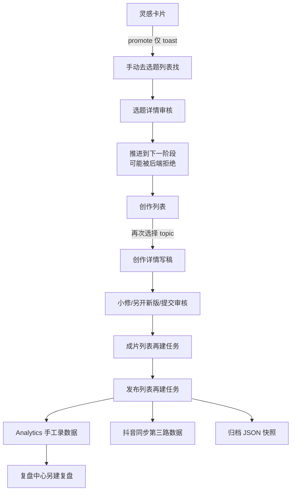
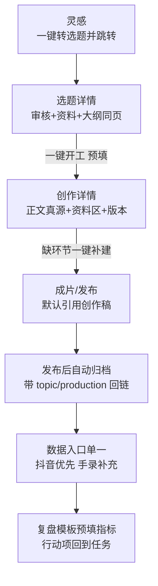

# XMT 产品改造清单（2026-09 · v3.1.2 审查）

> 目标：让传媒公司的人每天愿意打开 XMT，并更快、更舒服地完成「灵感 → 资料 → 写稿 → 协作 → 审核 → 发布 → 数据复盘」。
> 本轮只观察、分析、提方案、排优先级；不改业务代码、不改生产数据、不做大规模重构。
> 证据来源：`main` 分支真实代码 + 本地 `data/xmt.db` 真实数据 + 浏览器实测（1366×768 / 亮暗主题）。

---

## A. XMT 当前整体评价

### 视觉
Studio Atelier（v3.1.0）方向正确：深空墨蓝 + 发丝线 + 玻璃层 + 镜面高光，已经比典型后台更像「内容生产控制台」。但落地仍是**双设计系统并存**：
- `studio/*` + `xmt-btn*` + token（Topics/Home/Publishing 等）
- `useThemeStyles` + `common/*` + 页面自写 `rounded-xl bg-studio-primary`（TopicDetail/Analytics/Users/Production 列表等）

结果：同一产品里按钮/卡片/弹窗圆角、阴影、hover 行为不一致；浅色下大量 `bg-white/[0.0x]` 暗色玻璃片几乎消失；`text-studio-cyan hover:text-white` 在浅色下 hover 后文字看不见（`ProductionDetail.tsx:591,787`）。首页 Bento 硬编码深色渐变，浅色主题不生效。ogl/ReactBits 动画在控制台刷屏 `Color format not recognised`（单次首页 4000+ 条 warning），装饰层成本过高。

**结论：气质对了，统一度不够；需要「收敛」而不是再设计一套。**

### 易用性
信息架构过载：8 组导航、40+ 路由，但日常真正高频的只有选题/创作/成片/发布/消息/日报。存在：
- 双资料体系（`/resources` vs `/asset-center/*`）
- 三套复盘（Retrospectives / CreatorReports / Export 周报 + Analytics report）
- 选题三视图（Topics 列表 / Kanban / Calendar）各自成页
- 6 个 Content*/Collaboration* 调试面板高度同构
- 隐藏页仍可直达（`/analytics`、`/export`、`/retrospectives` 侧栏无稳定入口）
- CommandPalette 硬编码 12 项，漏掉灵感/看板/日历/复盘/抖音等

按钮消失问题（v3.1.2）已在创作详情修好——1366×768 实测「另开新版 / 小修保存 / 提交审核」均可见且可换行。但同类风险源仍在：`GlassPanel` 默认 `overflow-hidden`、表格 `min-w-[1080px]`、版本侧栏 `xl:grid-cols-[...320px]` 无小屏降级、z-index 多套浮层体系。

### 内容生产效率
**当前最大问题不是缺功能，是链路割裂：**
1. 灵感转选题只 toast 不跳转，无 topic_id 回链（`Inspirations.tsx:266-285`）
2. 选题「进入创作」跳列表页，建创作还要再选一次 topic
3. 状态双轨：Topic 手动「推进到下一阶段」+ workflow 后端二次改状态，UI 可点但可能被拒
4. 稿件内容散落五处：topic.outline / production.content / 材料草稿 / shooting.script / publishing.script（发布侧改稿会静默分叉）
5. 指标三录：Publishing 手填、Analytics 再录、抖音同步第三路，无对账
6. **严重 bug：`Production.tsx:138-160` 编辑保存调用 `createProduction` 而非 update——每次编辑保存会新建一条创作记录**

从灵感到发布约 12–15 次点击、5 个列表页 + 3–4 个详情页。创作者被流程推着走，而不是被内容拉着走。

### 信息架构
一级导航定位清晰（首页/内容生产/资料中心/抖音运营/日报/组织协作/系统管理），但：
- 「日报系统」整组只有 DailyReportPage 三个 tab 路由
- 「资料中心」5 入口 4 个库 + 搜索，真正能用的主要是知识库（山东地情 16120 条）和内容档案（15 条）
- 系统管理混放用户/权限/审批流/模板/系统配置/备份/日志/匿名意见/登录灰度
- 调试入口需 `?debug=1` 是好设计，但 ContentOS 等能力与「数据分析」边界模糊
- 命令面板、首页工具区、导航三套入口指向不一致（资源库 `/resources` vs `/asset-center`）

### 编辑体验
Tiptap + Yjs + 版本 + 格式刷 + 协作已有专业底子。问题在「治理过重、写作过轻」：
- 缺搜索替换、缺字数目标/写作目标、缺从大纲一键续写
- AddTopic 大纲仍走 `mode="legacy"`（已废弃的 RichTextEditor）
- AddTopic「保存草稿」是假草稿（与提交同为 pending，无续写）
- Topic/Shooting/发布稿无版本，只有 Production 有 minor/major
- Y.Doc 全在 Node 内存，重启靠 HTML 恢复，长时间协作有中间态风险
- leave-guard / GracefulDispose / superseded 弹窗代码量大，且 TopicDetail 离开弹窗文案仍是「aggregate draft / Runtime dispose」（`TopicDetail.tsx:863`）
- 目标是「让人愿意长时间写稿」，目前更像「版本治理控制台」

### 数据分析
- `Analytics`：团队/月度/用户统计 + 手工录数 + 导出 + 周报文案——是数字面板，不指导创作
- 抖音运营中心：官方导出口径治理认真（v2.22–v3.0.5 修了大量假增长/假基线问题），有作品分层、健康度、趋势
- 复盘（Retrospectives）有指标快照 + 行动项，是**最接近「可行动」**的一块，但未挂到发布/选题闭环
- ContentIntelligence/OS/Generation：建议只读，不能回写正文
- 缺回答：「最近什么表现好 → 下条拍什么 → 标题怎么改」

### 移动端
Android 有独立 MobileShell 5 Tab（首页/选题/工作/消息/我），覆盖选题/创作/日报方向正确。但：
- 手机浏览器仍是 PC 缩小版（仅 `isAndroid()` 切壳）
- WorkHub 跳出的排期/看板/灵感/成片仍是桌面页
- 状态/角色显示英文 raw value（`topic.status`、`user.role`）
- Android versionName 2.19.3 与 package.json 3.1.2 不一致，包过期
- 编辑器复用桌面 ContentEditor，小屏写作体验未单独设计

### 性能
- 首页并行拉 pending×100 + **全量 topics/publishing 循环翻页**（`Home.tsx:62-80`）
- `getProduction()` 无分页，且 Production 页重复调用 4 次
- `getMessages()`/`getUsers()` 无参全量
- 首页 ReactBits/ogl 控制台数千条 warning
- 大页面组件（NotificationSettings 986 行、TopicDetail 868、Login 914）几乎无 memo
- 资源中心 1.6 万条知识库已具备 FTS，但主入口仍偏浏览

### 稳定性
- 编辑器写入一致性规范（Yjs/DB/Snapshot 三源）是认真治理过的
- 但 Production 编辑保存变新增是**数据正确性 bug**
- 审核成功无反馈、消息已读失败静默、周报加载失败吞掉
- 双通道通知（桌面 Notification + RealtimeToast）可能双发
- 近版（v3.1.x）版本说明质量好；更早「放了些小惊喜」空洞，`changelog.ts` 有版本号撞车与工程师笔记外泄

### 长期产品潜力
**潜力高。** 已有：完整内容主链路、权限/角色、协作编辑、抖音数据资产、知识库 FTS、日报/复盘。产品愿景（内容中台 → 品牌中台 → 行业中台）与现有骨架匹配。风险不在「能不能做更大」，而在**功能面继续膨胀、真源不统一、日常体验不够顺手**——先收敛再扩展，才有品牌化/复制价值。

---

## B. 当前最值得改的 10 个问题（按影响范围排序）

### 1. 创作「编辑保存」实际是新建记录
【当前问题】`Production.tsx` 的 `handleUpdate` 调用 `createProduction`，不是 update。
【用户实际感受】改完稿子一点「保存」，创作列表多一条，版本/负责人/状态错乱；越认真编辑越脏。
【根因】编辑弹窗与创建弹窗共用提交路径，未区分 update。
【建议改法】编辑走 update API；若历史已产生重复记录，提供一次性「合并重复创作」核对清单（按 topic_id+content 相似度），不自动删生产数据。
【涉及页面】创作管理列表 / 编辑弹窗
【预计工作量】小
【风险】低（修复本身）；清理历史数据需人工确认
【收益】极高——直接止损数据污染

### 2. 状态双轨 + 假草稿，流程「点了不一定算数」
【当前问题】Topic 手动推进 vs workflow 后端联动校验；AddTopic 草稿与提交同路径。
【用户实际感受】推进失败原因不明；「保存草稿」第二天找不到未完成稿。
【根因】Topic 状态机与 Production/Shooting/Publishing 副表状态两套语义并行；无 draft 生命周期。
【建议改法】单一状态真源（以 Topic 阶段为准，副表状态作子状态）；推进按钮前置校验「缺创作/缺成片」并一键补建；AddTopic 增加真实草稿（或本地草稿 + 续写列表）。
【涉及页面】Topics / TopicDetail / Production / Shooting / Publishing / AddTopic / workflow API
【预计工作量】中
【风险】中（状态迁移需兼容历史数据）
【收益】极高——减少「白点」和重复录入

### 3. 首页不是工作台，是聚合看板
【当前问题】Bento 指标 + 待办只展示 pending 选题 + 工具快捷 + 灵感/公告；待办只能点进详情。
【用户实际感受】进来不知道「今天我该干什么」；管理员看不到全团队卡点；创作者看不到自己的稿。
【根因】首页按「有什么数据展示什么」拼装，未按角色任务流设计；且为算指标全量拉数。
【建议改法】见 G 节：第一屏「我的今日任务」，第二屏「内容流卡点」，砍掉工具墙/意见箱/番茄钟常驻。
【涉及页面】Home
【预计工作量】中
【风险】低
【收益】极高——每天第一眼价值

### 4. 跨分辨率/浏览器按钮与浮层被裁切（类 v3.1.2 问题面）
【当前问题】版本按钮已修，但 `GlassPanel overflow-hidden`、表格 min-width、320px 固定侧栏、多套 z-index 仍在。
【用户实际感受】其他电脑/缩放下工具按钮、下拉、操作列时有时无。
【根因】布局用固定列宽 + overflow-hidden 裁切；测试只做字符串断言不做真浏览器多分辨率。
【建议改法】工具栏/操作区统一 `flex-wrap + min-w-0 + shrink` 契约；GlassPanel 对编辑器容器 `overflow-visible`；表格统一 `ResponsiveTableShell`；建立 1366/1440/1920 + 80%/90%/100%/110%/125% 视觉回归清单。
【涉及页面】全站（优先 ProductionDetail / Editor Toolbar / Topics 表格 / 各 Detail 操作区）
【预计工作量】中
【风险】低
【收益】极高——直接对应真实投诉

### 5. 亮色主题「暗色残留」与 hover 同色
【当前问题】`bg-white/[0.0x]`、`hover:text-white`、BubbleMenu/Login 同色叠字、浅色 muted 对比不足、全局 selection 过淡。
【用户实际感受】切亮色后层级消失、hover 文字没了、选中看不清。
【根因】token 有了但组件仍写死暗色玻璃与 white；双主题源（`xmt_theme` vs `useTheme`）。
【建议改法】P0 修 hover/同色叠字；`bg-white/[0.0x]` → `bg-studio-surface-soft/xx`；浅色 muted ≥4.5:1；合并主题源；扩展 light-theme 对比测试覆盖面。
【涉及页面】ProductionDetail / EmptyState / CommandPalette / BubbleMenu / Login / 全站
【预计工作量】小–中
【风险】低
【收益】高——亮色可用性

### 6. 稿件多处存放、发布侧改稿分叉
【当前问题】大纲 / 创作稿 / 材料草稿 / 成片脚本 / 发布脚本 五处；发布可再改剧本且不回写。
【用户实际感受】「到底哪份是最终稿？」；归档快照与线上稿不一致。
【根因】按流程表拆分存储，缺「内容主版本」概念。
【建议改法】明确「创作稿 = 正文真源」；成片/发布默认引用创作稿，允许「衍生脚本」并标记分叉；归档关联 production_id/topic_id 可反查。不强制合并表。
【涉及页面】ProductionDetail / ShootingDetail / PublishingDetail / 归档
【预计工作量】中
【风险】中
【收益】高——减少版本混乱

### 7. 灵感→选题→创作链路断点多、无查重
【当前问题】promote 不跳转无回链；不能查「以前是否做过类似」；资料不能引用溯源。
【用户实际感受】好想法埋没；重复开发同一选题；写稿时资料用完就丢。
【根因】灵感是孤立 CRUD；资源插入是 HTML 拷贝无 resource_id。
【建议改法】promote 后直达 `/topics/:id` 并回写灵感 topic_id；灵感/选题搜标题相似（先用现有 FTS/标题分词即可）；资料插入增加「引用来源」轻量标记（见 H/I）。
【涉及页面】Inspirations / Topics / AddTopic / ProductionResourcesPanel
【预计工作量】中
【风险】低
【收益】高——内容资产开始沉淀

### 8. 通知与操作反馈「不知道成没成功」
【实施进度 · v3.3.43】消息中心已有待处理筛选和列表关联跳转；桌面提醒现按选题与消息类型在 5 分钟窗口内复用通知标记，窗口内更新不重复提示音，消息记录和未读状态仍逐条保留。桌面通知点击只接受安全站内路径并直达业务页，外站/异常链接退回消息中心。通知契约、消息设置、移动消息/账号安全 320/390px 浏览器、Android runtime/endpoint 契约、类型、版本、定向 lint、生产构建与 Android Web 资源同步通过；lint 仅有既有 `any` 警告，构建有既有大分包提示。无 API、权限、数据库变化。真实系统通知授权、多标签、真实账号及 Android APK/真机未验证；本机缺 Java/adb/SDK。

【实施进度 · v3.3.42】移动消息读取失败且没有本机缓存时显示错误及重试，成功返回空列表时才显示“暂无消息”；本机缓存可用时提示数据可能较旧。未读标记失败或离线时保留在消息页，成功后才打开关联内容。移动账号页修改密码校验当前密码和新密码 6 位下限，请求中锁定重复提交并保留成功提示。移动浏览器在 320px/390px 覆盖失败重试、表单校验与双击请求去重；类型检查、版本检查、定向 lint、草稿契约和生产构建通过。该项不改变服务端密码规则、权限、API 或数据库。真实账号和 Android APK/真机仍待验收。
【当前问题】审核成功无 toast；消息已读失败静默；桌面通知 + toast 双发；设置保存无反馈；Logo「上传成功」实为本地选图。
【用户实际感受】点了像没点；通知轰炸或完全无感。
【根因】反馈未纳入组件契约；通知无频控/聚合。
【建议改法】所有 mutation 统一 success/error toast 契约；通知去重合并（同 topic 同类型 5 分钟聚合）；「待处理」消息一键直达业务对象。
【涉及页面】Topics 审核 / Messages / NotificationSettings / Mobile* / RealtimeToast
【预计工作量】小–中
【风险】低
【收益】高——信任感

### 9. 设置页技术栈外泄、用户/管理员边界糊
【实施进度 · v3.3.25】设置中心已按“我的设置 / 系统管理 / 产品信息”分组；管理分类仍分别按系统配置和备份权限显示，失去权限后回退到个人通知偏好。关于页读取已保存品牌信息，移除未经检测的运行正常、模块已启用和固定备份承诺；配置和备份读取失败可重试，阻止默认配置误保存。沿用现有设置路由，未拆成多个独立 URL。当前 AuthRolloutStatus 已具备管理员运维明细折叠。隔离浏览器已验证三类权限视图、错误恢复和桌面/窄屏布局；真实账号与生产验收仍未执行。

【当前问题】「关于系统」全员可见 Express+SQLite+Socket.IO；备份暴露 `data/xmt.db`；AuthRollout 通篇工程师语言。
【用户实际感受】普通编辑看不懂、不敢点；重要配置（品牌/通知）和运维配置挤在一起。
【根因】设置页按「我们有什么配置」组织，不是按「谁需要改什么」。
【建议改法】拆「我的设置」（资料/密码/外观/通知）与「系统管理」（品牌/备份/权限/登录安全）；技术信息折叠进管理员「关于」脚注。
【涉及页面】NotificationSettings / AuthRolloutStatus / BackupPage
【预计工作量】中
【风险】低
【收益】中高——专业感与安全感

### 10. 移动端是「能用的 PC 子集」，不是「外出工作台」
【实施进度 · v3.3.27】移动创作列表/详情与 `production:view`、`production:update` 权限对齐；只读稿件隐藏提交动作且不读写本地草稿，无查看或修改权的入口显示拒绝。移动通知读取偏好、渠道、事件三项并校验全部成功后才可保存，失败可重试，避免接口失败时空列表覆盖用户偏好。隔离浏览器已覆盖只读、无查看、无新建权限，以及通知 503→重试→保存恢复。剩余移动写入流程仍需逐页审计。

【实施进度 · v3.3.28】移动选题新建/编辑与 `topic:create` / `topic:update` 及服务端所有者边界一致；待审核详情新增独立 `topic:audit` 通过/驳回与意见操作；日报提交要求 `report:daily:submit`，权限确认前不恢复本地草稿，日报加载失败可重试且禁止空表单覆盖；移动消息批量已读逐条确认并保留部分失败状态。拍摄/发布路由已有 `workflow:*` 路由权限，日历关联选题已有服务端归属校验。契约测试与构建通过；本机后端不可用，本轮未获得可信浏览器交互证据，真实账号和生产仍未验收。

【实施进度 · v3.3.30】拍摄、发布与移动创作编辑器在手机宽度采用基础写作工具栏，保留撤销/重做、常用字形、列表和链接；完整工具栏仅保留在桌面。发布编辑区在窄屏改为上下排列。Playwright 在 320px、390px、1440px 响应式视口下验证发布详情无横向溢出且保存/取消按钮可见；390px 下拍摄“完成制作”操作可见。Android `versionName` 已和工程版本同步到 3.3.30，`versionCode=30330`；APK 和真机尚未构建/验收，实时协作后端未连接。

【实施进度 · v3.3.31】工作中心看板点击拍摄中/发布中选题时，按 `topic_id` 查找相应流程记录并使用流程记录 ID 打开详情；缺记录或查询失败时提示并返回选题详情。补充路由解析回归测试。无数据库迁移；真实账号与生产环境仍待验收。

【实施进度 · v3.3.32】移动工作中心日历、灵感与看板在 320px/390px 浏览器下完成入口、月切换、取消提交与返回流程验收，页面无横向溢出。修复灵感按钮/卡片动作窄屏断字、触屏删除入口不可见、看板筛选标签竖排。使用本地隔离 API 夹具；真实账号、生产与 Android 真机仍待验收。

【实施进度 · v3.3.33】首页快捷入口进入日历后可返回首页，工作中心入口仍返回工作中心；日历排期、已转化灵感可直接打开关联选题，选题详情可返回来源页。320px/390px Playwright 隔离夹具通过；真实账号、API 服务端及 Android 真机仍待验收。

【实施进度 · v3.3.34】移动日历加载失败时显示明确错误与重试，加载中/失败时隐藏可能属于旧月份的汇总；创建失败后保留表单并可重试，避免重复请求。临时数据库验收确认日历事件所有者与关联选题的服务端权限边界。320px/390px 浏览器夹具、权限 API 测试通过；未新增日历编辑/删除交互。

【实施进度 · v3.3.35】移动日报草稿保存成功而后续提交失败时，立即保留服务端新版本号；用户重试携带该版本，避免旧版本导致 409 冲突。320px/390px 隔离浏览器夹具覆盖提交 503→新版本重试成功，日报权限契约测试通过。真实账号、生产 API、Android 真机仍待验收。

【实施进度 · v3.3.36】移动创作详情按服务端 `canEditProduction` 能力和 `production:update` 双重确认写范围；无归属编辑权的 director 可只读查看，编辑器不会恢复本地改稿，也不显示保存/提交入口。临时 SQLite 验证 editor 可编辑、director 越范围写入仍 403；隔离 Playwright 覆盖只读/可编辑角色。真实账号、生产 API、Android 真机仍待验收。

【实施进度 · v3.3.37】移动选题详情权限状态更新不再触发重复加载和控件反复卸载；提报/审核 API 保留服务端错误说明。隔离 Playwright 覆盖 member 提报 503 后重试、选题负责人编辑失败后刷新恢复草稿、仅有 `topic:audit` 的 director 审核失败后保留意见并重试；既有权限规则未改变。真实账号、生产 API、Android 真机仍待验收。

【实施进度 · v3.3.39】移动日报补齐未填写、草稿、审核中、已通过、已退回、已归档的中文状态与对应操作说明；退回时直接显示审核意见，已通过/归档为只读且始终展示服务端内容，不恢复或覆盖本机未提交草稿。依据服务端可编辑状态契约验证 320px/390px 移动浏览器流程；未改变权限或状态机，无数据库迁移。真实账号、生产服务、Android APK/真机仍待验收。

【实施进度 · v3.3.40】移动首页、选题列表/详情、创作列表及拍摄/发布列表/详情对未知状态显示“状态待确认”；拍摄 `pending` 显示为“计划中”，不泄漏原始枚举、不留白，未知选题状态使用中性样式，发布详情状态用语与列表一致。消息页核对确认内部 `type` 不直接展示，页面使用中文业务分类。Android 工程版本与 production endpoint manifest 同步为 `3.3.40 / 30340`。本阶段不修改权限、状态机、API 或数据库；隔离 Playwright 覆盖首页/选题列表与详情以及拍摄/发布 320px/390px 列表与详情。真实账号、生产服务、Android APK/真机仍待验收。

【实施进度 · v3.3.41】移动消息缓存与选题提报/修改、创作稿及日报本机草稿按当前账号隔离；共享设备切换账号后不再从旧版无归属键或其他账号键恢复内容。原本机数据不自动删除或迁移，避免无法确认归属时错误披露。隔离浏览器复验第二账号消息、选题和日报页面，既有 320px/390px 工作流回归通过。无权限、API、数据库变化；真实账号/Android 真机仍待验收。

【实施进度 · v3.3.42】移动消息读取失败且没有可用缓存时显示错误和重试，成功返回空数组才显示“暂无消息”；未读标记失败或离线时留在消息页显示反馈，成功后才打开关联内容。移动改密码增加与服务端一致的必填和 6 位长度校验，请求期间阻止重复提交，成功后保留页面展开以显示成功提示。隔离 Playwright 在 320px/390px 覆盖加载/标记失败恢复、密码校验和双击去重；移动工作流、共享设备隔离、草稿契约、类型检查、版本检查、定向 lint、生产构建与 `git diff --check` 通过。无服务端规则、权限、API 或数据库变化；真实账号及 Android APK/真机仍待验收。

【实施进度 · v3.3.38】移动“我的”账号页补全文案、后期、摄像角色中文显示；Android 工程版本与 production endpoint manifest 同步到 3.3.38 / 30338，契约校验通过。前端与 Capacitor 同步通过；debug APK 因本机缺 Java Runtime 未能生成，真机仍待验收。未调整角色授权。

【实施进度 · v3.3.26】手机浏览器首次打开时按视口选择现有移动壳层和移动页面，选择在本次打开期间固定以保护编辑状态；原生 Android 认证和端点逻辑保持独立。工作子页导航归属、返回入口及全局操作反馈已补齐，390px 下工作中心→真实日历→切换月份→返回工作通过隔离验证。日历/看板/灵感/拍摄仍复用现有响应式页，真机编辑、全部入口验收及 Android 包升级尚未完成。

【原始审查问题（v3.1.2）】状态/角色英文、WorkHub 跳桌面页、编辑器未适配、Android 包版本落后。其中 WorkHub 手机浏览器入口、选题状态、七种内置角色中文显示、移动编辑器、日报及拍摄/发布状态已在 v3.3.26–v3.3.40 分阶段处理；v3.3.41 增加共享设备本机内容账号隔离，v3.3.42 补充移动消息失败态区分与改密码重复提交保护。消息页不直接展示内部 severity/type 枚举。剩余 Android APK 构建、真机和真实账号验收需要具备 JDK 的环境。
【用户实际感受】外场只能看个大概，审核/改稿费劲。
【根因】Android 优先做了壳和登录，未按移动任务裁剪。
【建议改法】见 I 节：移动端只保留查看/轻改/灵感/审核/评论/简单数据。
【涉及页面】mobile/* / WorkHub / Android 构建
【预计工作量】中
【风险】低
【收益】中高——覆盖外场与管理者

---

## C. 视觉改造方案

方向锚点维持 **Studio Atelier · Content Ops Control Room**（Linear 精度 × Pro App 材质 × Arc 层级），目标不是更炫，而是：**现代、专业、耐看、长时间办公不疲劳**。改造原则是**收敛到已有 token**，禁止再发明第二套。

| 项 | 现状问题 | 改法 |
|---|---|---|
| **色彩** | 双色板、硬编码 hex、暗色玻璃片、浅色 muted 不足 | 唯一源 `tokens.css`；禁业务 hex；新增 `--xmt-overlay-tint` 替换 `bg-white/[0.0x]`；浅色 `text-muted` 提到 ≥4.5:1；主强调仅 primary，cyan/violet/coral/amber 只作数据/语义 |
| **字体** | 层级尚可，数据未处处 tabular | 保持 Inter/PingFang；标题 24–32/600、正文 14/1.6、标签 12；指标/时间/版本号统一 `.xmt-data-number` |
| **卡片** | XMTCard / GlassPanel / .xmt-card / 页面自写 四套 | 只保留 **GlassPanel（区块）+ XMTCard/MotionCard（列表项）**；圆角 18/22 不再出现 28/34 业务圆角；阴影只用 card/floating/modal 三级 |
| **页面间距** | 有的挤有的松 | 8px 基数；页边距 24；卡片距 16；列表项高 48–56；专业工具偏紧但区块间必须呼吸 |
| **导航** | 8 组过碎、名称跳、入口三套 | 收成 5 组：工作台 / 内容生产 / 资料与资产 / 运营数据 / 系统（admin）；调试面板合并进「系统 → 实验室」；CommandPalette 从 `allNavigationItems` 生成 |
| **按钮** | 三套按钮 + ConfirmModal 自写 | 一律 `ActionButton`（ReactBitsButtonSlot）；危险操作统一 danger variant；禁页面手写 `bg-studio-primary`；**所有工具栏按钮 `flex-wrap + min-w-0`，禁止被 shrink 裁掉** |
| **表格** | min-w 硬编码、无统一壳 | 一律 `ResponsiveTableShell` + 操作列 sticky 右侧；禁在 `overflow-hidden` 卡片内再横滚 |
| **弹窗** | BaseModal 与页面自写 fixed 并存 | 全部走 BaseModal/FormModal/ConfirmModal + `.xmt-overlay`；统一 z-index 表（见 J） |
| **编辑器** | chrome 与正文色板曾混用 | chrome 走 `--editor-*`；正文高亮/批注保持内容语义色；选区继续用高对比 `--editor-selection-*`（v3.1.1 已修） |
| **暗色模式** | 有的区域灰成一片、有的过亮 | 恢复层级：app-bg → surface → surface-soft → elevated；玻璃透明度统一；禁纯黑底+纯白字大块 |
| **响应式** | 按钮消失类问题 | 见 B4；增加 1366×768 / 1440×900 / 1920×1080 / 缩放 80–125% / 小窗 的「核心操作始终可见」契约测试（真浏览器，不只字符串断言） |

签名时刻保留 4 个即可：卡片顶边 sheen、玻璃壳层叠、数据 tabular-nums、页面入场 stagger。**装饰性粒子/ogl 默认关闭**（性能与控制台噪音）。

---

## D. 功能改造方案

### P0（必须解决）
1. 修复创作编辑保存变新增（B1）
2. 核心操作按钮跨分辨率/缩放可见契约 + GlassPanel 裁切修复（B4）
3. 亮色 hover/同色叠字/对比度（B5）
4. 审核/保存/删除/导出等 mutation 统一成功失败反馈（B8）
5. Topic 状态推进前置校验与明确失败原因（B2）
6. 移除 UI 程序员语言（TopicDetail 离开弹窗、System Update、AES/HMAC、api/app.ts 等）（第十九节）
7. 移动端状态/角色中文映射（B10 部分）

### P1（明显提升体验）
1. 首页改造成角色化工作台（G）
2. 灵感→选题直达 + topic_id 回链 + 标题相似提示（B7）
3. 选题详情「一键开工」预填创作；缺环节一键补建（B2/F）
4. 编辑器补搜索替换、字数/目标、写作模式（H）
5. 资料区：直接内容 + 引用插入 + 来源 + 已用标记（H 资料区）
6. 设置拆分「我的 / 系统」（B9）
7. 通知聚合与「待处理」直达（B8）
8. 列表分页/虚拟化：Production / Messages / Home 指标（J）
9. 合并重复入口：Kanban→Topics 视图；/resources→asset-center；调试面板 6→1
10. 真实选题草稿或本地续写

### P2（以后可以做）
1. 内容资产库：按城市/人物/项目聚合历史稿、资料、数据（L）
2. 数据指导创作：表现好选题/标题模式 → 选题建议（第十节）
3. 全局搜索 ⌘K 覆盖稿件/资料/日报/复盘全文（已有 FTS 可复用）
4. 协作编辑增强（批注线程、审阅建议模式）
5. 移动端审核/评论完整化 + 推送（默认关，按需开）
6. 品牌化配置（系统名/登录形象/默认主题）——服务「品牌中台」愿景
7. 指标单一真源与抖音/手录对账
8. Yjs 运行态持久化（降协作丢中间态风险）

**每条 P 功能都对应真实问题；答不出「解决什么真实问题」的不进列表**（例如：再加 AI 按钮、再加图表 Dashboard、再加设置项——都不做）。

---

## E. 建议删除 / 合并的功能

| 动作 | 对象 | 理由 |
|---|---|---|
| **删除** | `pages/DouyinCreatorDataCenter.tsx` | 孤儿页，无路由引用 |
| **删除/并入** | ContentOS / ContentIntelligence / ContentGeneration / CollaborationDashboard / CollaborationUX 五页 | 同 context 同构调试面板 → 合成「内容实验室」1 页多 Tab |
| **删除入口** | ExportPage 的「月报/总结」空页签 | 纯「规划中」占位；月报总结已在日报 Summary |
| **合并** | Kanban + Calendar → Topics 页内「列表 / 看板 / 日历」视图 | 同一批 Topic 三入口 |
| **合并** | `/resources` → `/asset-center` | 双资料体系；Home 工具「资源库」改指 asset-center |
| **合并** | Analytics 的 DataExport + WeeklyReport ↔ ExportPage | 报告中心一处即可 |
| **合并** | 「日报系统」3 路由同组件 | 导航组降级为一项「日报与总结」 |
| **降级** | Achievements / Pomodoro 独立页 | 首页已有 compact 番茄钟；成就并入「我的」或消息 |
| **隐藏** | AuthRolloutStatus 对普通用户 | 仅管理员「系统 → 登录安全」，文案改用户可读 |
| **隐藏** | 备份页 SQLite 路径/引擎细节 | 管理员可见摘要即可 |
| **收敛** | ConfirmModal / 页面自写 modal / 三套按钮 | 只留 studio 契约 |
| **取消重复操作** | 编辑创作再选 topic；灵感转选题后手动找；发布数据与分析双录 | 预填/回链/单一指标入口 |
| **取消** | 版本更新全屏渐变大弹窗常驻打断 | 改顶栏轻提示 + 设置内更新说明 |
| **不删但冻结** | RichTextEditor legacy | 已 deprecated；AddTopic 迁出后不再新用 |

---

## F. 内容生产流程优化

### 当前流程（真实点击路径）

问题：约 **12–15 次点击、5 列表 + 3–4 详情**；灵感无回链；状态双轨；内容五处存放；指标三录。

### 建议流程（少跳页、真源清晰）

| 改造 | 为什么 |
|---|---|
| 灵感 promote 成功 → `navigate(/topics/:id)` + 灵感存 `topic_id` | 消灭「创建了但找不到」 |
| 选题详情「开始创作 / 建成片 / 建发布」预填外键与标题 | 消灭重复录入与跳列表 |
| Topic 阶段为唯一主状态；副表状态为子状态；推进前检查并一键补建 | 消灭「点了不算数」 |
| 成片/发布默认只读引用创作稿，衍生稿显式「分叉」 | 消灭最终稿不明 |
| 发布完成自动归档 + 可反查 | 资产开始沉淀 |
| 指标以抖音官方导出为准，手录作补充并标注来源 | 消灭三录不一 |
| 复盘从发布记录一键带出指标快照 | 数据真正指导下一轮 |

**让创作者少跳页面的核心：详情页一站式，列表只做发现与批量。**

---

## G. 首页改造方案

### 设计原则
首页回答四个问题：**今天做什么 / 卡在哪 / 谁要处理 / 最近有什么变化**。角色不同第一屏不同。禁止「有数据就堆」。

### 第一屏（角色化「我的今日」）
| 角色 | 内容 |
|---|---|
| 创作者 | 我的进行中稿件（含保存状态）/ 截止临近 / 待我修改的退回稿 / 快速「记灵感」「写两句」 |
| 编辑/编导 | 待我审核选题与稿件 / 团队卡点（超 2 天未动）/ 今日发布 |
| 管理员/负责人 | 全团队卡点 / 逾期 / 数据异常（播放骤降、同步失败）/ 待处理消息 |

交互：每条任务**就地可点下一步**（通过/退回/打开编辑器），不是只「查看详情」。

### 第二屏「内容流」
横向阶段条：灵感池 → 待审 → 创作中 → 成片 → 待发 → 已发 → 复盘。每阶段显示数量 + 3 条最新 + 卡点时长。点击进入筛选后的列表。

### 第三屏「最近变化」（可折叠）
- 我参与稿件的新版本/新评论
- 关注选题的状态变化
- 可选：本周播放/粉丝（有权限且有数据才显示）

### 删除/移出首页
| 模块 | 处理 |
|---|---|
| Bento 七宫格 + 再四张 MetricCard 重复指标 | **删**（指标去「运营数据」） |
| 实用工具 6 宫格（含隐藏页导出/番茄钟） | **删**，入口回归导航 |
| 热门灵感 + 投票 | **移**到灵感库；首页最多 1 条「灵感提醒」 |
| 公告板 | **保留但压缩**为顶栏公告条 |
| 意见箱 | **移**到用户菜单 |
| 番茄钟常驻 | **移**到「我的」或快捷命令 |
| 全量拉 topics/publishing 算指数 | **删**，改服务端聚合接口 |

### 首屏信息密度
一屏内：问候 + 3–6 条可操作任务 + 阶段概览条。少卡片、多列表行；数字只出现在阶段计数与真正关键的 1–2 个 KPI。

---

## H. 编辑器改造方案

目标：**媒体稿件创作台**，不是 Word 复制品，也不是版本治理控制台。

### 保留（已够好）
- Tiptap 格式、表格、引用、高亮、批注
- 自动保存 + 明确保存状态
- minor/major 版本（小修/另开新版）语义符合媒体改稿习惯
- 格式刷、协作光标、沉浸写作（immersive）
- 资料区可调高度 + 直接编辑资料内容

### 补齐（真正影响写稿）
1. **搜索替换**（含高亮命中）
2. **字数与目标**：当前字数/目标字数/预计阅读时长（稿件常见需求）
3. **专注写作模式**：隐藏侧栏与版本历史，只留正文 + 细保存条
4. **大纲续写**：从大纲标题一键插入小节骨架
5. **AddTopic 迁出 legacy**，与主编辑器同一能力

### 简化（过重干扰创作）
1. leave-guard 文案与交互改为「有未保存修改」三态，去掉 Runtime 术语
2. superseded 全屏弹窗改为编辑器顶部一条可操作 banner
3. 协作/遥测/适配器保留在代码层，**UI 只暴露**：在线协作者、保存状态、冲突提示
4. 无权限时显示只读原因，不显示「无编辑权限」灰按钮

### 资料区（延续「直接展示、低学习成本」）
| 做 | 不做 |
|---|---|
| 资料正文直接可读可改可粘贴 | 复杂资料块类型系统 |
| 选中资料片段 →「插入正文 / 引用插入」 | 向量 AI 知识库 |
| 引用插入自动带「来源：资料名」小字 | 强制脚注编号体系 |
| 搜索资料、标记「已用/待用」 | 重型标签治理后台 |
| 抽屉高度拖拽（已有） | 多窗格 IDE 布局 |
| 可选：一键「摘要」（有 AI 能力时） | 自动整理打乱用户笔迹 |

插入策略：**引用插入**保留来源；**粘贴全文**作草稿素材。记录 resource_id 以便「这篇稿用过哪些资料」。

---

## I. Android 移动端改造方案

### 手机真正需要留下的
| 优先级 | 能力 | 说明 |
|---|---|---|
| P0 | 查看稿件/选题 | 列表 + 详情可读、状态中文 |
| P0 | 轻改稿件 | 纯文本/轻格式 + 保存状态，不搬全量工具栏 |
| P0 | 快速记灵感 | 桌面/锁屏快捷入口，一屏提交 |
| P0 | 待办与审核 | 通过/退回 + 简短意见 |
| P1 | 评论/@ | 针对段落或整篇 |
| P1 | 我的任务/截止 | 今日、本周 |
| P1 | 简单数据 | 播放/粉丝/完成数，不做分析 |
| P1 | 日报 | 已有，保留 |
| P2 | 消息推送 | 默认关，审核/退回/@ 才推 |

### 不要搬到手机的
完整富文本工具栏、版本历史管理、资料库四库管理、权限/备份/工作流设计、抖音采集 Agent 配置、数据分析多图、模板管理、活动日志、品牌设置。

### 其它
- 手机浏览器访问走移动壳，而不是 PC 缩小版
- WorkHub 外链页做移动简化或改为原生列表
- 状态/角色/错误全部中文
- Android 版本号与 package.json 对齐发布

---

## J. 技术改造建议（只列影响稳定/性能/维护/跨设备的）

1. **数据正确性**：Production update 误 create；清理重复创作需脚本 + 人工确认，禁止盲删
2. **列表性能**：`getProduction`/`getMessages`/`getUsers`/Home 聚合加分页或服务端 summary API
3. **响应式契约**：核心操作 `visible` 真浏览器矩阵测试；GlassPanel overflow 策略；表格统一壳
4. **Z-index 单表**：sticky 工具栏 30 / 页面浮层 80 / modal 200 / 命令面板 300 / 编辑器菜单 400，写入 tokens
5. **主题源唯一**：废弃 `useTheme` 双轨，统一 `xmt_theme` + store + `data-theme`
6. **ReactBits 默认轻量**：ogl/粒子默认 off，避免数千 console warning 与低端机卡顿
7. **通知管道**：socket 事件 → 业务通知 → UI 反馈 一条链，去掉双发
8. **Yjs 持久化**（P2）：至少定期 snapshot 落库，降低重启丢中间态
9. **Android 构建版本与文档同步**；HTTPS 环境变量发布检查
10. **禁止**为洁癖整体重写路由/状态/编辑器——在现有 monolith 上渐进

开发约束（实施阶段必须遵守）：
- 不破坏生产数据；migration 必须写明回滚
- 保证桌面端、Android、亮暗主题、多分辨率
- 每次 UI/功能/修复/删除/性能变更：升版本号 + 中文更新说明 + 中文 commit/PR/发布说明

---

## 内容层面文案原则（配套第十九节）

| 禁止出现 | 改为 |
|---|---|
| API / Payload / Runtime / Sync job | （不出现）保存 / 同步 / 系统 |
| HTTP error / Internal Error | 「保存失败，请重试」+ 可复制错误码（管理员） |
| aggregate draft / Runtime dispose | 「有未保存的修改」 |
| SQLite (libsql) / data/xmt.db | 「本地数据」（管理员详情折叠） |
| Socket.IO / Express / React | 关于页脚注或删除 |
| System Update | 「版本更新」 |
| Failed to load users | 「成员列表加载失败」 |
| topic.status 英文 raw | 已有中文映射表，全端复用 |
| 暂无数据 | 「还没有稿件，去创建第一条选题吧」+ 按钮 |
| 放了些小惊喜 | 写清用户可感知变化 |

---

## 改造路线图（3–6 个月）

### 第一阶段（约 2–4 周）· 修明显问题
**目标**：止血，让每天敢用。
**改什么**：
1. Production 编辑保存 bug + 重复数据核对清单
2. 按钮/浮层跨分辨率可见性与 GlassPanel 裁切
3. 亮色 hover/对比/同色叠字
4. 审核等关键操作成功失败反馈
5. UI 程序员语言清理（含 TopicDetail 离开弹窗）
6. 移动端状态中文
**为什么先做**：都是「信任」问题，工作量小、收益大、不动库结构。
**预计影响**：全角色每日操作不再踩坑；投诉类问题下降。

### 第二阶段（约 4–8 周）· 优化核心体验
**目标**：少跳页、第一屏有用、写稿顺手。
**改什么**：
1. 首页工作台化（G）
2. 灵感→选题直达与回链；选题「一键开工」
3. 状态推进前置校验 + 一键补建环节
4. 编辑器搜索替换/字数/专注模式；AddTopic 去 legacy
5. 资料引用插入 + 来源 + 已用标记
6. 设置拆分我的/系统；通知聚合
7. 重复入口合并（Kanban/Resources/调试面板）
8. 列表分页与 Home 聚合接口
**为什么其次**：直接提升「每天愿不愿意打开」。
**预计影响**：主链路点击数约降 30–50%；写稿与审核体验明显变好。

### 第三阶段（约 6–10 周）· 升级内容生产流程
**目标**：流程成为一条内容流水线。
**改什么**：
1. Topic 主状态真源 + 副表子状态（兼容历史）
2. 成片/发布引用创作稿 + 分叉标记
3. 发布自动归档回链；AddTopic 真草稿
4. 复盘从发布带出指标；行动项回到任务
5. 指标单一来源与抖音优先口径
**为什么后做**：涉及状态与数据语义，需在体验稳定后做兼容迁移。
**预计影响**：从想法到发布/复盘真正连起来；重复录入基本消失。

### 第四阶段（约持续）· 完善内容资产与数据能力
**目标**：数据指导创作，资产可复用。
**改什么**：
1. 内容资产库（按主题/人物/地点聚合历史稿、资料、数据）
2. 全局搜索（复用 resource_fts + 稿件全文）
3. 表现分析 → 选题/标题建议（可执行入口，不是图表墙）
4. 移动端审核评论完整化、推送
5. 品牌化配置（服务品牌中台愿景）
6. Yjs 快照落库
**为什么最后**：建立在流程与真源之上，否则又变成堆功能。
**预计影响**：公司内容不消失、可检索、可复用；XMT 从工具变成内容资产中台。

---

## 附录：本轮验证证据（摘要）

- 版本操作按钮在 1366×768 实测可见：当前版本查看/编辑、小修保存、另开新版、提交审核
- 本地数据规模：选题 74、创作 48、发布 21、灵感 54、消息 1263、资源 16135（知识 16120 + 内容档案 15）、日报 118、复盘 1、production_materials 0、番茄钟 0
- 首页控制台：ogl `Color format not recognised` 大量重复 warning
- 明确 bug：`Production.tsx` handleUpdate → `createProduction`
- 明确文案：`TopicDetail.tsx:863` aggregate draft / Runtime dispose
- 双设计系统：`studio/*` vs `useThemeStyles` 并存
- 孤儿页：`DouyinCreatorDataCenter.tsx`

---

*本文档为产品审查与改造清单，不含代码变更。实施时请按版本管理原则递增版本号并同步中文更新说明。*
